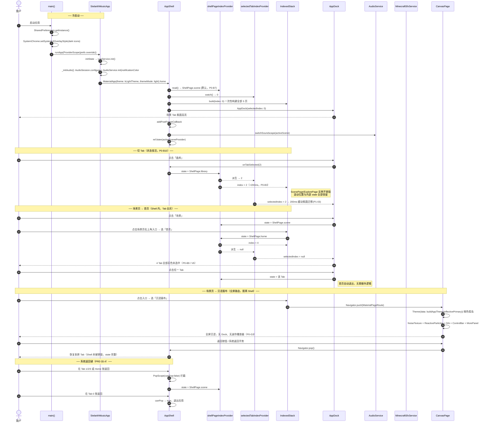
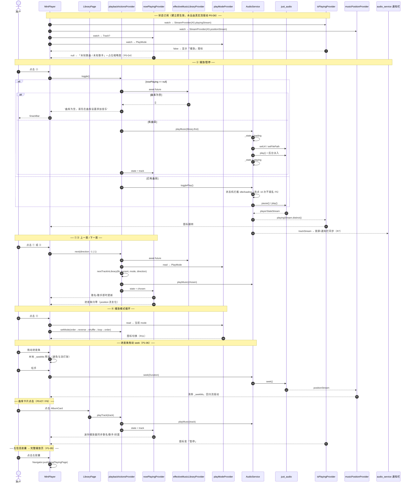
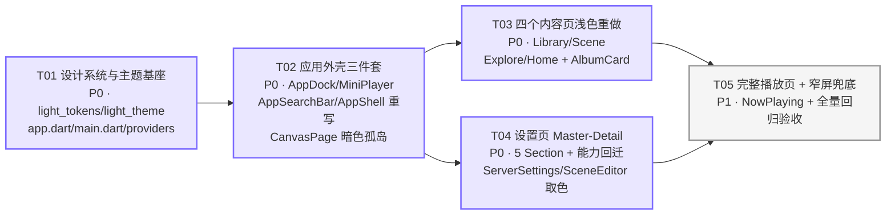

# 星璃音乐空间 · UI 全面重构 系统架构设计

| 项 | 值 |
|---|---|
| 文档版本 | v1.0 |
| 作者 | 高见远（架构师） |
| 上游输入 | `docs/PRD_UI_重构.md` v1.0 + Q1–Q5 用户裁决 |
| 项目路径 | `D:\Stellara\Music\xingli_music` |
| 技术栈 | Flutter 3.9+ / Riverpod 2.6 / just_audio 0.9 / audio_service 0.18 |
| 代码基线 | 66 个 Dart 文件；`app_shell.dart` 327 行；`Color(0x` 命中 64 处 / 14 个文件 |
| 本文档定位 | 工程师直接执行依据（设计 + 任务分解合一） |

---

## 0. 裁决落盘（实现唯一依据）

| 问题 | 裁决 | 架构含义 |
|---|---|---|
| **Q1** 迷你播放器 | **4 按钮**（上一首 / 播放暂停 / 下一首 / 播放模式） | `MiniPlayer` 右胶囊 4 槽；完整播放页维持 P1；ControlBar 能力完整承接 |
| **Q2** Tab 选中态 | **紫底白图标**：`#7C6BFF` 圆 Ø44 + 白图标 + `#7C6BFF` 文字 | 放弃 `NavigationBar`，自建 `AppDock`；Ø44 圆挤压标签位（见 §1.3 几何裁定） |
| **Q3** 搜索栏底色 | **`#E8E8E8`** | `AppColors.bgInput = 0xFFE8E8E8` 定稿 |
| **Q4** 设置页结构 | **Master-Detail**（左 52dp 竖栏 5 tile + 右详情区） | `SettingsPage` 完全重写为双栏 |
| **Q5** 设置分类重映射 | **授权功能性偏离**：播放 / 音源 / 场景 / 通知 / 关于 | 5 槽位 → 真实能力映射，`ServerSettingsPage`、`SceneEditorPage`、`PalettePanel` 全部保留可达 |

其余：Q6 授权「换皮不换结构」，Q7 采用方案 A，Q8 完整播放页 P1，Q9 采用 A′（见 §8），Q13 粒子/噪点/光球仅留 `CanvasPage`。

---

## 1. 实现方案与框架选型

### 1.0 核心判断：这是一次「作用域收缩」，不是「删除重写」

现有代码里的深色沉浸式资产（`ControlBar` 384 / `MorePanel` 694 / `VolumeSlider` 290 / `PalettePanel` 308 / `NoiseTexture` 47 / `ReactiveParticles` 30 / `SceneParticles` 220 / `Orb` 148 / `SceneCardStack` 219 = 约 2340 行）**全部仍被 `CanvasPage` 引用**（已核验 `canvas_page.dart` import 列表）。

因此本次重构的正确姿势是：

> **不删除任何现有文件。**把这些组件的「消费者」从「主 Shell + 4 Tab」收缩为「仅 `CanvasPage`」。

理由：
1. **G1 只要求引用数 = 0，不要求文件不存在** —— 收缩即可达标，删除是多余风险；
2. **P1-09 明确要求画布保留粒子/噪点/光球** —— 删了就得重写；
3. **G3「零功能倒退」** —— 2340 行经过验证的交互逻辑，删除等于重新引入 bug；
4. 收缩式改造使本次 diff 集中在「新增文件 + 6 个页面重写」，回滚成本低。

### 1.1 主题系统迁移策略（确认 PRD §8.1，并做 3 处优化）

PRD §8.1 的四条建议**全部确认**。在此基础上追加三项架构优化：

#### 优化 ①：Token 用 `static const` 类，**不用** `ThemeExtension`

```dart
// lib/core/theme/light_tokens.dart
abstract final class AppColors {
  static const Color bgPage = Color(0xFFFFFFFF);
  static const Color accent = Color(0xFF7C6BFF);
  // ...
}
```

**为什么不用 `ThemeExtension<AppTokens>`**：`Theme.of(context).extension<T>()` 返回的值不是编译期常量，会让 `AppDock` / `MiniPlayer` / `AlbumCard` 这些高频重建组件失去 `const` 构造能力，同时引入 `InheritedWidget` 依赖（主题变化时全树重建）。本次是**固定色板**，运行时不会变，`ThemeExtension` 的唯一优势（主题切换）用不上。P2 若要做深色模式，届时再引入 `ThemeExtension` 亦不迟——那是一次孤立的重构。

#### 优化 ②：`MaterialApp` 主题**脱离** `effectivePrimaryProvider`

现状 `app.dart:98` 是 `ref.watch(effectivePrimaryProvider)` → 用户在调色盘改一个色，**整个 MaterialApp 子树重建**。重构后主题固定，必须切断这条链：

```dart
// app.dart —— 主题不再 watch 任何 provider
theme: kLightTheme,        // 顶层 final，全进程构建一次
darkTheme: kLightTheme,    // 防御：系统深色模式也不许翻脸
themeMode: ThemeMode.light,
```

#### 优化 ③：`CanvasPage` = **暗色主题孤岛**（本方案的关键手法）

`CanvasPage` 及其子树（`ControlBar` / `MorePanel` / `VolumeSlider` / `PalettePanel` / `Orb` / `SceneCardStack`）依赖 `theme.colorScheme.onSurface` 取白色系。全局改浅色后它们会全部「变白瞎」。

解法不是逐个改这 2340 行，而是**在 CanvasPage 内部重新注入旧的暗色主题**：

```dart
// canvas_page.dart build() 最外层
return Theme(
  data: buildAppTheme(ref.watch(effectivePrimaryProvider)), // 旧的动态暗色主题
  child: Scaffold( ... 原有全部内容 ... ),
);
```

一行代码，让 2340 行沉浸式资产**零改动存活**，且 `DerivedPalette` 的「动态派生配色」品牌资产完整保留在它唯一该在的地方。`buildAppTheme()` / `DerivedPalette` / `DesignTokens` / `palette_presets` 全部保留不动，只在文件头加一行注释声明其作用域。

#### 主题层最终形态

| 层 | 文件 | 消费者 | 色彩来源 |
|---|---|---|---|
| 固定浅色（新） | `light_tokens.dart` + `light_theme.dart` | `MaterialApp` / AppShell / 4 Tab / Home / 设置子页 | 编译期常量 |
| 动态暗色（旧，保留） | `app_theme.dart` + `palette.dart` + `design_tokens.dart` | **仅** `CanvasPage` 子树 | `effectivePrimaryProvider` 运行时派生 |

### 1.2 `buildLightTheme()` 与 §6 Token 的映射

```dart
ColorScheme.light(
  primary:            AppColors.accent,          // #7C6BFF
  onPrimary:          AppColors.onAccent,        // #FFFFFF
  secondary:          AppColors.accent,
  onSecondary:        AppColors.onAccent,
  surface:            AppColors.bgPage,          // #FFFFFF
  onSurface:          AppColors.textPrimary,     // #1A1A1A
  surfaceContainerLowest:  AppColors.bgPage,     // #FFFFFF
  surfaceContainerLow:     AppColors.bgSurface,  // #F5F5F5
  surfaceContainer:        AppColors.bgSurfaceSunken, // #EEEEEE
  surfaceContainerHigh:    AppColors.bgRail,     // #EAEAEA
  surfaceContainerHighest: AppColors.bgDock,     // #E6E6E6
  outline:            AppColors.borderDefault,   // #EAEAEA
  outlineVariant:     AppColors.divider,         // #EEEEEE
  error:              AppColors.danger,          // #E5484D
)
```

配套 `ThemeData`：`useMaterial3: true`、`scaffoldBackgroundColor: bgPage`、`splashFactory: InkSparkle.splashFactory`、`textTheme` 按 §6.6 七档落地、`cardTheme` 圆角 24 + `borderDefault` 描边 + `elevation: 0`、`listTileTheme` 文字色改 `textPrimary`/`textSecondary`、`dividerTheme` 用 `divider`、`sliderTheme`/`progressIndicatorTheme` 用 `accent`。

> **关键**：`ColorScheme.light` 的 `surfaceContainer*` 五档正好承接中性色阶 `neutral0→300`，这样即便工程师偷懒用了 `Theme.of(context).colorScheme.surfaceContainer`，取到的也仍是 Token 内的值——**给「不小心」留一条正确的退路**，是降低走查成本的关键设计。

### 1.3 自定义 `AppDock` 组件方案（细化 PRD §8.2）

确认放弃 `NavigationBar`（M3 indicator 固定 `StadiumBorder` 64×32，容器矩形，无法满足「满宽药丸 + 内部 Ø44 正圆」）。

```
ClipRRect(borderRadius: 38)                    ← ① 水波纹裁剪兜底，必须在最外层
└ Container h=76, color:#E6E6E6,
    borderRadius:38, border: 1px #FFFFFF
  └ Material(type: transparency)               ← ② InkWell 需要 Material 祖先
    └ Row
      └ 4 × Expanded                           ← ③ 等分，热区 97×76 ≫ 44×44 ✅
          └ InkWell(onTap)
            └ Column(mainAxisAlignment: center)
              ├ AnimatedContainer 44×44        ← ④ 200ms easeOutCubic，P1-03
              │   shape: circle
              │   color: sel ? accent : transparent
              │   └ Icon(26, sel ? onAccent : iconInactive)   ← ⑤ 200ms 内隐式补间需 AnimatedSwitcher 或直接切换
              ├ SizedBox(height: 1)
              └ AnimatedDefaultTextStyle 200ms  ← ⑥ 10sp/w500，sel ? textAccent : textTertiary
```

**四个实现要点**：
1. `ClipRRect` 在 `Container` 外层——`InkWell` 的水波纹绘制在 `Material` 层，只有外层裁剪能挡住它溢出药丸；
2. 图标颜色不能用 `AnimatedContainer` 补间（它不管 child），用 `TweenAnimationBuilder<Color?>` 或直接切换（Ø44 圆的 200ms 动画已足够提供动效感知，图标硬切可接受）；
3. 未选中态 `color: Colors.transparent` 而非 `null`，否则 `AnimatedContainer` 不做补间；
4. `Row` 内不要放 `SizedBox` 分隔——4 个 `Expanded` 严格等分才符合 x=0/104/208/312 的设计坐标。

**⚠️ 几何裁定（Q2 派生，必须记录）**

PRD §10 给出：Tab 图标 y=13.6、标签 y≈44。但 Q2 裁定引入 Ø44 圆后，圆以图标为中心则占据 y=4.6–48.6，**与 y=44 的标签重叠 4.6dp**。原线框的 y=44 是在「无实心圆指示器」前提下测得的，两者不可兼得。

架构裁定（保图标位、下移标签）：

| 元素 | y（tab 内，dp） | 与设计稿偏差 |
|---|---|---|
| 顶部留白 | 0–5 | — |
| Ø44 紫圆（图标 26 居中，图标中心 y=27） | 5–49 | 图标中心 27 vs 26.4，**Δ0.6 ✅** |
| 间隙 | 49–50 | — |
| 标签 10sp（行高 1.2 → 12dp） | 50–62 | 标签顶 50 vs 44，**Δ6.0 ⚠️** |
| 底部留白 | 62–76 | — |

合计 76dp 精确对齐。**Δ6dp 的标签下移是 Q2 裁决的数学必然，不是实现误差**，请在 V1 视觉走查时按此基准验收（建议将 Dock 标签一项的容差放宽到 8dp，其余元素维持 4dp）。

### 1.4 `MiniPlayer`：4 按钮 + 防溢出（承接 Q1 + PRD §8.3）

```
SizedBox(height: 80)
└ Column
  ├ Padding(horizontal: 34) → _ProgressBar(h=8, radiusPill)     ← 8dp
  └ SizedBox(height: 72)                                        ← 72dp，合计恰好 80 ✅
    └ Row
      ├ Expanded → _InfoPill    (白底/r36/shadowCard)
      ├ SizedBox(width: 5)
      └ Expanded → _ControlPill (白底/r36/shadowCard)
          └ Padding(all: 12)
            └ Row: [Expanded btn]×4，间隔 SizedBox(width: 6)     ← ⚠️ 不用固定 36dp
```

**防溢出决策**：PRD §8.3 测算「固定 36dp 按钮在 320dp 屏溢出 18.5dp」。本方案两处根治：
1. **控制按钮用 `Expanded` 均分**而非固定 36dp → 数学上永不溢出（`Expanded` 会压缩到 0 也不报 overflow）；
2. **图标用 `FittedBox(fit: BoxFit.scaleDown)` 包裹** 26dp `Icon` → 极窄屏自动缩小而非裁切。

同时依 §10，迷你播放器与 Dock 均为**满宽（水平外边距 0）**，只有内容容器有 14dp 外边距。这比 PRD §8.3 假设的 14dp 边距更宽裕：320dp 屏单胶囊可用 `(320−5)/2 = 157.5dp`，`Expanded` 方案下完全安全。水平外边距抽为 Token `AppSize.shellEdgeInset = 0`，若走查后决定改 14 只需改这一个常量（见 §8 待明确 A1）。

**播放/暂停状态源**（P0-D8 硬约束）：只允许 `ref.watch(isPlayingProvider).valueOrNull ?? false`，**禁止**任何 `setState` 本地态推断。快速连点 10 次不错乱的根因在于 `AudioService` 内部的 `PlaybackState` 状态机已做 `loading` 拦截，UI 层只需忠实反映流。

### 1.5 状态管理：新增 provider 与现有体系的衔接

新建 `lib/providers/shell/shell_providers.dart`，**只加 4 个，不动任何现有 provider**：

```dart
/// Shell 页面索引常量（对应 IndexedStack.children 顺序）
abstract final class ShellPage {
  static const int home = 0;     // 主页 —— Tab 0
  static const int library = 1;  // 曲库页 —— Tab 1
  static const int world = 2;    // 世界页 —— Tab 2
  static const int explore = 3;  // 探索页 —— Tab 3
  static const int settings = 4; // 设置页 —— Tab 4
  static const int count = 5;
  static const int tabCount = 5;
  static bool isTab(int index) => index >= 0 && index < tabCount;
}

/// 唯一真源：当前 Shell 页面索引（0..4），冷启动默认「主页」
final shellPageIndexProvider = StateProvider<int>((_) => ShellPage.home);

/// 派生：Dock 高亮 Tab（非 Tab 页 → null，对应设计稿「4 Tab 全灰」）
final selectedTabIndexProvider = Provider<int?>((ref) {
  final i = ref.watch(shellPageIndexProvider);
  return ShellPage.isTab(i) ? i : null;
});

/// 各页搜索关键词（按页面索引分槽，切 Tab 不互相污染）
final searchQueryProvider = StateProvider.family<String, int>((ref, i) => '');

/// 切换 Shell 页面的统一入口（唯一写入点）
void setShellPage(WidgetRef ref, int pageIndex) { /* 边界校验 + 赋值 */ }
```

> ✏️ **落地回填（治理 C-2）**：原设计稿此处为 `enum ShellPage` + `shellPageProvider`（StateProvider\<ShellPage\>）。落地演化为上方形态：`ShellPage` 为常量类、真源改 `shellPageIndexProvider`（StateProvider\<int\>），并新增 `setShellPage` 统一写入口、`searchQueryProvider` family 合并原 `librarySearchQueryProvider` / `settingsSearchQueryProvider`。以 `lib/providers/shell/shell_providers.dart` 为准。

新建 `lib/providers/settings/settings_ui_providers.dart`：

```dart
enum SettingsGroup { basic, advanced, about }   // 设置页一级分组（用户定版）

enum SettingsSection {
  audio,        // 基础·音频：音量、静音、播放模式、EQ + 音源入口
  visual,       // 基础·画面：外观、场景、游戏、性能
  notification, // 基础·通知：通知中心、后台播放
  experiment,   // 高级·实验：同意状态、逐项启停、大模型
  about,        // 关于：应用信息、日志上报
}
final settingsSectionProvider = StateProvider<SettingsSection>((_) => SettingsSection.audio);
```

> ✏️ **落地回填（治理 C-3）**：原设计稿为 `enum SettingsCategory { playback, source, scene, notification, about }` + `settingsCategoryProvider`。落地演化为上方形态：新增一级分组 `SettingsGroup`，`SettingsCategory` → `SettingsSection`（audio/visual/notification/experiment/about，音源入口并入 audio），命名与 `lib/providers/settings/settings_ui_providers.dart` 对齐。

**与现有体系的衔接原则**：

| 现有 provider | 重构后归属 | 说明 |
|---|---|---|
| `nowPlayingProvider` / `isPlayingProvider` / `musicPositionProvider` / `musicDurationProvider` / `playModeProvider` | `MiniPlayer` 消费 | 直接复用，接口不变 |
| `playbackActionsProvider` | `MiniPlayer` / `LibraryPage` 的**唯一动作入口** | 已封装 toggle / next / playTrack / setMode，返回提示串 |
| `musicVolumeProvider` / `soundscapeVolumeProvider` / `musicMutedProvider` / `soundscapeMutedProvider` | 设置页「播放」分类消费 | 承接 `VolumeSlider` 能力 |
| `volumeSliderOpenProvider` / `paletteOpenProvider` | **仅 CanvasPage 消费** | 主 Shell 不再读写 |
| `moodKindProvider` | 设置页「场景」分类 + CanvasPage 双消费 | 非视觉 Token，可跨主题使用 |
| `derivedPaletteProvider` / `sessionSeedProvider` / `showParticlesProvider` | **仅 CanvasPage 消费** | G1 达标关键 |
| `activeSceneProvider` / `sceneOrderProvider` / `currentSceneIndexProvider` | `ScenePage` + CanvasPage 双消费 | 场景数据，与配色无关 |
| `effectiveMusicLibraryProvider` | `LibraryPage` 消费 | 接口不变 |

> **不新建任何 service。**播放侧一律经 `playbackActionsProvider`（UI 意图层）→ `AudioService`（引擎层）。`PlaybackController` 继续只服务系统媒体控件。这条边界现在是清晰的，不要打破。

### 1.6 全局组件的实现位置与复用策略

| 组件 | 位置 | 由谁渲染 | 复用范围 |
|---|---|---|---|
| `AppDock` | `widgets/shell/app_dock.dart` | **AppShell**（1 处） | 全局唯一实例 |
| `MiniPlayer` | `widgets/shell/mini_player.dart` | **AppShell**（1 处） | 全局唯一实例，5 页共享 → 天然满足 P0-D1「5 页持续可见」与 V5「位置一致」 |
| `ContentContainer` | `widgets/shell/content_container.dart` | **AppShell**（1 处，包住 `IndexedStack`） | `#F5F5F5` / r36 / margin 14 / padding 18 —— 由 Shell 统一提供，**5 个页面自身不再画容器** |
| `AppSearchBar` | `widgets/shell/app_search_bar.dart` | **各页面自己**（4 处） | 因 placeholder 与 query provider 按页不同（P0-C3），且 Home 不渲染（P0-C4），故不由 Shell 统一插入 |

**关键架构决策：`ContentContainer` 由 Shell 提供，`AppSearchBar` 由页面提供。**
前者所有页面完全一致（含 Home），提到 Shell 消除 5 份重复；后者存在「Home 无 / 文案不同 / 绑定不同 query」三重差异，留在页面反而更简单。这条切分线让每个 Tab 页的 build 简化成：`Column([AppSearchBar(...), SizedBox(18), Expanded(内容)])`。

---

## 2. 文件列表

### 2.1 新增（16 个）

| # | 路径 | 职责 | 预估行数 |
|---|---|---|---|
| N01 | `lib/core/theme/light_tokens.dart` | §6 全部固定 Token：`AppColors` / `AppRadius` / `AppSpace` / `AppSize` / `AppShadow` / `AppTextStyles` | 180 |
| N02 | `lib/core/theme/light_theme.dart` | `buildLightTheme()` + 顶层 `final kLightTheme` | 140 |
| N03 | `lib/providers/shell/shell_providers.dart` | `ShellPage` 枚举 + 4 个 provider | 40 |
| N04 | `lib/providers/settings/settings_ui_providers.dart` | `SettingsSection` 枚举 + `SettingsGroup` + provider + 元数据表（回填 C-3） | 50 |
| N05 | `lib/widgets/shell/app_dock.dart` | 自定义药丸 Dock（§1.3） | 130 |
| N06 | `lib/widgets/shell/mini_player.dart` | 双胶囊迷你播放器 + 进度条 + 4 按钮（§1.4） | 260 |
| N07 | `lib/widgets/shell/app_search_bar.dart` | 圆角胶囊搜索栏（受控，绑定外部 query provider） | 90 |
| N08 | `lib/widgets/shell/content_container.dart` | `#F5F5F5` / r36 内容容器 | 40 |
| N09 | `lib/widgets/common/album_card.dart` | 曲库专辑卡（封面 72 + 3 行文本） | 130 |
| N10 | `lib/widgets/common/state_views.dart` | `LoadingView` / `ErrorView(onRetry)` / `EmptyView(onAction)` 三件套 | 110 |
| N11 | `lib/widgets/common/settings_tile.dart` | 浅色设置行：开关行 / 滑块行 / 跳转行 / 选择行 | 160 |
| N12 | `lib/pages/settings/sections/playback_section.dart` | 音量 / 静音 / 播放模式 / 音景音量（承接 `VolumeSlider` + `MorePanel`） | 150 |
| N13 | `lib/pages/settings/sections/source_section.dart` | 跳转 `ServerSettingsPage` + 源状态摘要 | 70 |
| N14 | `lib/pages/settings/sections/scene_section.dart` | 跳转 `SceneEditorPage` / `PaletteStudioPage` + 心情选择器 | 130 |
| N15 | `lib/pages/settings/sections/notification_section.dart` | 后台播放 / 锁屏控件 / 通知栏说明 | 70 |
| N16 | `lib/pages/settings/sections/about_section.dart` | 版本 / 日志 / 开源信息 | 70 |
| N17 | `lib/pages/settings/palette_studio_page.dart` | **暗色主题孤岛**，全屏承载 `PalettePanel` | 50 |
| N18 | `lib/pages/now_playing/now_playing_page.dart` | 完整播放页（**P1**，T05 交付） | 220 |

> N01–N17 为 P0，N18 为 P1。

### 2.2 修改（10 个）

| # | 路径 | 改动性质 | 要点 |
|---|---|---|---|
| M01 | `lib/app.dart` | 中改 | `theme/darkTheme = kLightTheme`；`themeMode: ThemeMode.light`；`notificationColor: 0xFF7C6BFF`（P0-A5）；移除 `effectivePrimaryProvider` 的 `watch`；包 `AnnotatedRegion<SystemUiOverlayStyle>` 设 `statusBarIconBrightness: Brightness.dark` |
| M02 | `lib/app_shell.dart` | **完全重写**（327 → 约 120 行） | 见 §3.3 |
| M03 | `lib/main.dart` | 微改 | `SystemChrome.setSystemUIOverlayStyle(dark icons)` + `setEnabledSystemUIMode(edgeToEdge)` |
| M04 | `lib/pages/scene/scene_page.dart` | 重写（35 → 约 180 行） | 浅色场景网格 + 右上角隐藏页入口（Q7-A） |
| M05 | `lib/pages/explore/explore_page.dart` | 重写（94 → 约 160 行） | 6 宫格心情卡换皮为浅色（Q6 授权「换皮不换结构」） |
| M06 | `lib/pages/library/library_page.dart` | 重写（63 → 约 190 行） | 2 列网格 + 加载/错误/空三态 + 搜索过滤 |
| M07 | `lib/pages/home/home_page.dart` | 重写（68 → 约 130 行） | 浅色「当前播放」卡，**无搜索栏**（P0-C4） |
| M08 | `lib/pages/settings/settings_page.dart` | **完全重写**（62 → 约 200 行） | Master-Detail 双栏（§3.4） |
| M09 | `lib/pages/settings/server_settings_page.dart` | **仅取色替换**（515 行，改约 25 处） | 见 §2.4 硬编码色替换表；**逻辑一行不动** |
| M10 | `lib/pages/settings/scene_editor_page.dart` | **仅取色替换**（429 行，改约 6 处） | ⚠️ `_bgTop/_bgBottom/_particleColor` 的 `Color(0x...)` 是**场景数据默认值，禁止替换** |
| M11 | `lib/pages/canvas/canvas_page.dart` | 小改（340 行，加约 20 行） | ① 最外层包 `Theme(data: buildAppTheme(primary))` 暗色孤岛；② 左上角加返回按钮（P0-G3）；③ 确保 `Scaffold` 无 `bottomNavigationBar` |
| M12 | `lib/core/theme/app_theme.dart` | 仅加注释 | 文件头声明「**本主题仅供 CanvasPage 暗色孤岛使用，禁止用于主 Shell 与 4 Tab 页**」 |

### 2.3 保留但**退役到 CanvasPage**（零改动，仅移除主 Shell 引用）

`widgets/control_bar.dart`(384) · `widgets/more_panel.dart`(694) · `widgets/volume_slider.dart`(290) · `widgets/palette_panel.dart`(308) · `widgets/noise_texture.dart`(47) · `widgets/reactive_particles.dart`(30) · `widgets/scene_particles.dart`(220) · `widgets/orb.dart`(148) · `widgets/card_stack.dart`(219) · `core/theme/palette.dart`(113) · `core/theme/design_tokens.dart`(96)

**删除文件数 = 0。** 唯一动作是让 `app_shell.dart` 不再 import 它们。
（`PalettePanel` 例外：额外被 `PaletteStudioPage` 这个新的暗色孤岛引用，以满足 Q5「调色盘可达」。）

### 2.4 硬编码色机械替换表（M09 / M10 专用）

| 原值 | 替换为 | 出现处 |
|---|---|---|
| `Color(0xFF0E0A1F)`（Scaffold 底） | `AppColors.bgPage` | server ×1 |
| `Color(0xFF1A1230)`（dropdown 底） | `AppColors.bgSurface` | server ×1 |
| `Colors.white` | `AppColors.textPrimary` | server ×3, editor ×1 |
| `Colors.white70` | `AppColors.textSecondary` | server ×6 |
| `Colors.white54` | `AppColors.textTertiary` | server ×5 |
| `Colors.white38` / `Colors.white24` | `AppColors.textTertiary` / `AppColors.iconInactive` | server ×4, editor ×3 |
| `Colors.white.withValues(alpha: 0.05)` | `AppColors.bgSurface` | editor ×1 |
| `Colors.purpleAccent` | `AppColors.accent` | server ×1 |
| `Colors.greenAccent` / `Colors.redAccent` | `AppColors.success` / `AppColors.danger` | server ×2 |
| `AppBar(backgroundColor: Colors.transparent)` | `backgroundColor: AppColors.bgPage, foregroundColor: AppColors.textPrimary, elevation: 0` | server ×1, editor ×1 |

> 这是**纯查找替换**，不涉及任何控制流。工程师若发现某处替换后语义不对，停手并上报，不要自行发挥。

---

## 3. 数据结构和接口

### 3.1 类图

```mermaid
classDiagram
    direction LR

    %% ══════════ 主题 Token 层（新增，全 static const）══════════
    class AppColors {
        <<abstract final>>
        +Color bgPage$ "#FFFFFF"
        +Color bgSurface$ "#F5F5F5"
        +Color bgSurfaceSunken$ "#EEEEEE"
        +Color bgRail$ "#EAEAEA"
        +Color bgTile$ "#E7E7E7"
        +Color bgDock$ "#E6E6E6"
        +Color bgInput$ "#E8E8E8"
        +Color bgCard$ "#FFFFFF"
        +Color bgControl$ "#F5F5F5"
        +Color bgPlaceholder$ "#D9D9D9"
        +Color accent$ "#7C6BFF"
        +Color accentPressed$ "#6A57F0"
        +Color onAccent$ "#FFFFFF"
        +Color textPrimary$ "#1A1A1A"
        +Color textSecondary$ "#666666"
        +Color textTertiary$ "#999999"
        +Color textAccent$ "#7C6BFF"
        +Color iconInactive$ "#999999"
        +Color iconOnAccent$ "#FFFFFF"
        +Color borderDefault$ "#EAEAEA"
        +Color borderDock$ "#FFFFFF"
        +Color divider$ "#EEEEEE"
        +Color success$ "#2E9E5B"
        +Color danger$ "#E5484D"
    }
    class AppRadius {
        <<abstract final>>
        +double sm$ 8
        +double md$ 18
        +double lg$ 24
        +double xl$ 36
        +double pill$ 999
    }
    class AppSpace {
        <<abstract final>>
        +double xs$ 4
        +double sm$ 5
        +double md$ 14
        +double lg$ 18
        +double xl$ 36
    }
    class AppSize {
        <<abstract final>>
        +double shellEdgeInset$ 0
        +double heightSearch$ 40
        +double heightMiniPill$ 72
        +double heightMiniGroup$ 80
        +double heightDock$ 76
        +double heightProgress$ 8
        +double icon$ 26
        +double tabIndicator$ 44
        +double cover$ 72
        +double railWidth$ 52
        +double tileW$ 48
        +double tileH$ 76
    }
    class AppShadow {
        <<abstract final>>
        +BoxShadow card$
        +BoxShadow cardSoft$
    }
    class AppTextStyles {
        <<abstract final>>
        +TextStyle title$ "18/w600"
        +TextStyle body$ "14/w400"
        +TextStyle trackName$ "14/w600"
        +TextStyle artist$ "12/w400"
        +TextStyle caption$ "11/w400"
        +TextStyle tabLabel$ "10/w500"
        +TextStyle tileLabel$ "9/w400"
    }
    class LightTheme {
        <<library>>
        +ThemeData kLightTheme$
        +ThemeData buildLightTheme()$
    }
    LightTheme ..> AppColors : maps to ColorScheme.light
    LightTheme ..> AppTextStyles : maps to TextTheme

    %% ══════════ Shell 状态层（新增）══════════
    class ShellPage {
        <<enumeration>>
        scene 0
        explore 1
        library 2
        settings 3
        home 4
    }
    class ShellProviders {
        <<library>>
        +StateProvider~int~ shellPageIndexProvider$
        +Provider~int?~ selectedTabIndexProvider$
        +StateProviderFamily~String, int~ searchQueryProvider$
        +void setShellPage(WidgetRef, int)$
    }
    ShellProviders ..> ShellPage

    class SettingsSection {
        <<enumeration>>
        audio
        visual
        notification
        experiment
        about
    }
    class SettingsGroup {
        <<enumeration>>
        basic
        advanced
        about
    }
    class SettingsSectionMeta {
        +SettingsSection id
        +IconData icon
        +String label "2 汉字"
        +Widget buildDetail(BuildContext, WidgetRef)
    }
    class SettingsUiProviders {
        <<library>>
        +StateProvider~SettingsSection~ settingsSectionProvider$
        +List~SettingsSectionMeta~ kSettingsSections$
    }
    SettingsUiProviders ..> SettingsSectionMeta
    SettingsSectionMeta --> SettingsSection

    %% ══════════ Shell 组件层（新增）══════════
    class AppShell {
        <<ConsumerWidget>>
        +Widget build(context, ref)
        -Widget _buildBody()
        -void _onBack()
    }
    class ContentContainer {
        <<StatelessWidget>>
        +Widget child
        +Widget build(context)
    }
    class AppDock {
        <<ConsumerWidget>>
        +int? selectedIndex
        +ValueChanged~int~ onTabSelected
        +Widget build(context, ref)
    }
    class DockItem {
        <<StatelessWidget>>
        +IconData icon
        +String label
        +bool selected
        +VoidCallback onTap
    }
    class MiniPlayer {
        <<ConsumerWidget>>
        +Widget build(context, ref)
        -Widget _progressBar(pos, dur)
        -Widget _infoPill(Track?)
        -Widget _controlPill()
        -void _onPrev(ref)
        -void _onToggle(ref)
        -void _onNext(ref)
        -void _onCyclePlayMode(ref)
        -void _onSeek(ref, Duration)
        -void _openNowPlaying(context)
    }
    class AppSearchBar {
        <<ConsumerWidget>>
        +String hintText
        +StateProvider~String~? queryProvider
        +Widget build(context, ref)
    }
    AppShell *-- ContentContainer
    AppShell *-- AppDock
    AppShell *-- MiniPlayer
    AppDock *-- DockItem
    AppShell ..> ShellProviders : watch shellPage
    AppDock ..> ShellProviders : watch selectedTabIndex

    %% ══════════ 页面层 ══════════
    class ScenePage {
        <<ConsumerWidget>>
        -void _openHome(ref)
        -void _openCanvas(context)
    }
    class ExplorePage
    class LibraryPage {
        <<ConsumerWidget>>
        -List~Track~ _filter(List~Track~, String)
        -void _onTapCard(ref, Track)
    }
    class HomePage
    class SettingsPage {
        <<ConsumerWidget>>
        -Widget _rail(ref)
        -Widget _detail(ref)
    }
    class AlbumCard {
        <<StatelessWidget>>
        +Track track
        +VoidCallback onTap
    }
    class StateViews {
        <<library>>
        +Widget loadingView()$
        +Widget errorView(String, VoidCallback)$
        +Widget emptyView(String, String, VoidCallback)$
    }
    AppShell --> ScenePage : IndexedStack[0]
    AppShell --> ExplorePage : IndexedStack[1]
    AppShell --> LibraryPage : IndexedStack[2]
    AppShell --> SettingsPage : IndexedStack[3]
    AppShell --> HomePage : IndexedStack[4]
    ScenePage *-- AppSearchBar
    ExplorePage *-- AppSearchBar
    LibraryPage *-- AppSearchBar
    SettingsPage *-- AppSearchBar
    LibraryPage *-- AlbumCard
    LibraryPage ..> StateViews
    SettingsPage ..> SettingsUiProviders

    %% ══════════ 设置详情分区 ══════════
    class PlaybackSection
    class SourceSection
    class SceneSection
    class NotificationSection
    class AboutSection
    SettingsPage *-- PlaybackSection
    SettingsPage *-- SourceSection
    SettingsPage *-- SceneSection
    SettingsPage *-- NotificationSection
    SettingsPage *-- AboutSection

    %% ══════════ 既有能力（不改动，仅被消费）══════════
    class PlaybackActions {
        <<existing>>
        +Future~String~ toggle()
        +Future~String~ next(int direction)
        +Future~String~ playTrack(Track)
        +void setMode(PlayMode)
    }
    class AudioService {
        <<existing>>
        +Stream~bool~ playingStream
        +Stream~Duration?~ positionStream
        +Stream~Duration?~ durationStream
        +Future~void~ seek(Duration)
        +Future~void~ setMusicVolume(double)
        +Future~void~ setMusicMuted(bool)
        +Future~void~ setSoundscapeVolume(double)
        +Future~void~ setSoundscapeMuted(bool)
        +Future~void~ switchSoundscape(Scene)
    }
    class Track {
        <<existing>>
        +String title
        +String artist
        +String uri
        +String? coverUrl
        +String? coverPath
        +Duration? duration
    }
    class ServerSettingsPage {
        <<existing 515L, recolor only>>
    }
    class SceneEditorPage {
        <<existing 429L, recolor only>>
    }
    class PalettePanel {
        <<existing 308L, unchanged>>
    }
    class PaletteStudioPage {
        <<new · dark theme island>>
    }
    class CanvasPage {
        <<existing 340L · dark theme island>>
    }

    MiniPlayer ..> PlaybackActions : toggle/next/setMode
    MiniPlayer ..> AudioService : seek + streams
    MiniPlayer ..> Track
    LibraryPage ..> PlaybackActions : playTrack
    AlbumCard --> Track
    PlaybackActions ..> AudioService
    SourceSection ..> ServerSettingsPage : push route
    SceneSection ..> SceneEditorPage : push route
    SceneSection ..> PaletteStudioPage : push route
    PaletteStudioPage *-- PalettePanel
    PlaybackSection ..> AudioService : volume/mute
    ScenePage ..> CanvasPage : push fullscreen route
```



### 3.2 关键接口契约

#### `MiniPlayer` ↔ 音频层（Q1 四按钮）

| 按钮 | 读取（watch） | 动作（read） | 异常 |
|---|---|---|---|
| ① 上一首 | — | `ref.read(playbackActionsProvider).next(direction: -1)` | 返回非空串 → `SnackBar` |
| ② 播放/暂停 | `isPlayingProvider` → 图标 | `ref.read(playbackActionsProvider).toggle()` | 同上 |
| ③ 下一首 | — | `ref.read(playbackActionsProvider).next(direction: 1)` | 同上 |
| ④ 播放模式 | `playModeProvider` → 图标 | `.setMode(下一个 PlayMode)`，循环 order→reverse→shuffle→loop | 无 |
| 进度条 | `musicPositionProvider` / `musicDurationProvider` | 拖动 → `ref.read(audioServiceProvider).seek(d)`（P1-06） | `duration == null`（电台流）→ 进度条置灰不可拖 |
| 左信息胶囊 | `nowPlayingProvider` | 点击 → `Navigator.push(NowPlayingPage)`（P1-05） | `null` → 「未知歌曲 / 未知歌手」+ 占位缩略图（P0-D4） |

播放模式图标映射：`order → Icons.repeat` / `reverse → Icons.repeat` (镜像) / `shuffle → Icons.shuffle` / `loop → Icons.repeat_one`。

#### `AppDock` ↔ 导航 state

```dart
AppDock(
  selectedIndex: ref.watch(selectedTabIndexProvider),   // int? —— null = 非 Tab 态，4 Tab 全灰
  onTabSelected: (i) => setShellPage(ref, i),           // 统一写入口（回填 C-2）
)
```
`AppDock` **自身不读 provider**（保持纯组件、可单测），由 `AppShell` 注入。

#### 设置页 5 槽位映射（Q5 落盘）

| 槽位 | `SettingsSection`（回填 C-3；含旧槽位名） | 标签 | 图标 | 详情区内容 | 覆盖回归项 |
|---|---|---|---|---|---|
| 1 | `playback` | 播放 | `Icons.play_circle_outline` | 音乐音量滑块 / 音乐静音 / 音景音量滑块 / 音景静音 / 播放模式四选一 | R10, R11 |
| 2 | `source` | 音源 | `Icons.dns_outlined` | 「音乐服务器与本地目录」跳转行 → `ServerSettingsPage` + 已启用源数量摘要 | **R12（一票否决）**, R1–R5 |
| 3 | `scene` | 场景 | `Icons.landscape_outlined` | 「场景编辑器」→ `SceneEditorPage`；「调色盘」→ `PaletteStudioPage`；心情四选一（愉悦/平静/低落/兴奋） | **R13（一票否决）**, R14, P1-08 |
| 4 | `notification` | 通知 | `Icons.notifications_none` | 后台播放开关说明 / 锁屏控件状态 / 通知栏主题色说明 | R6, R7, R15 |
| 5 | `about` | 关于 | `Icons.info_outline` | 应用名 + 版本 0.1.0 / 「查看日志」→ `LogService` / 开源信息 | P0-F6 |

> 标签严格 2 汉字——52dp 宽栏 9sp 字号的物理上限。

### 3.3 `AppShell` 重写后的结构（M02）

```dart
Scaffold(
  backgroundColor: AppColors.bgPage,
  resizeToAvoidBottomInset: false,        // 见 §8 待明确 A3
  body: SafeArea(
    top: true,
    bottom: true,
    minimum: EdgeInsets.only(bottom: 2),  // Q9 方案 A′
    child: Column(children: [
      SizedBox(height: 14),                                  // 顶部外边距
      Expanded(                                              // ← 吸收 37dp 高度差
        child: ContentContainer(
          child: IndexedStack(index: page.index, children: const [
            ScenePage(), ExplorePage(), LibraryPage(), SettingsPage(), HomePage(),
          ]),
        ),
      ),
      SizedBox(height: 5),
      MiniPlayer(),                                          // 80
      SizedBox(height: 5),
      AppDock(selectedIndex: ..., onTabSelected: ...),       // 76
    ]),
  ),
)
```

保留但迁移的两处 `initState` 副作用（**不可丢**）：
1. 首帧后 `audioServiceProvider.switchSoundscape(activeScene)` —— 冷启动音景；
2. `ref.listen(activeSceneProvider, ...)` → `minecraftSfxServiceProvider.ensureScene(id)` —— R14 依赖。

因此 `AppShell` 仍需是 `ConsumerStatefulWidget`。而 `_idleDriftTimer` / `_drift`（粒子漂移）**移除**——粒子已不在主 Shell。

返回键（PRD §5.4）：用 `PopScope(canPop: false, onPopInvokedWithResult:)`，非 `scene` 页时回 `ShellPage.scene`，`scene` 页时放行退出。

### 3.4 `SettingsPage` Master-Detail 结构（M08）

```
Column
├ AppSearchBar(hint: '搜索设置项', query: settingsSearchQueryProvider)
├ SizedBox(height: 14)            ← 搜索栏底 58 → 卡片顶 72（P0-F1）
└ Expanded
  └ Container(r24, #EEEEEE)       ← 设置卡片
    └ Row
      ├ Container(w=52, #EAEAEA, 左侧 r24)          ← 竖分类栏
      │   └ Column: 5 × _CategoryTile(48×76, r18, 间距 4)
      │        选中：底 accent，图标+文字 onAccent
      │        未选：底 #E7E7E7，图标 iconInactive，文字 textTertiary
      └ Expanded
        └ AnimatedSwitcher(200ms)  ← 详情区，按 settingsCategoryProvider 切换
          └ SingleChildScrollView(padding: 16) → XxxSection()
```

---

## 4. 程序调用流程

### 4.1 冷启动 → 切 Tab → 进首页 / 画布 → 返回



### 4.2 播放控制流（迷你播放器 4 按钮 + 曲库卡片）



---

## 5. 任务列表（有序，5 个）

> 全部任务共享 §7「共享知识」约定。每个任务结束时必须跑一次 `flutter analyze` 并保证 **无 error**（G3 / E1）。

### T01 · 设计系统与主题基座 【P0】【无依赖】

| 项 | 内容 |
|---|---|
| **目标文件** | 新增 `core/theme/light_tokens.dart`、`core/theme/light_theme.dart`、`providers/shell/shell_providers.dart`、`providers/settings/settings_ui_providers.dart`；修改 `app.dart`、`main.dart`、`core/theme/app_theme.dart`（仅注释） |
| **依赖** | 无 |
| **改动范围** | 新增约 410 行；`app.dart` 改 6 行；`main.dart` 加 3 行 |
| **涉及旧组件清理** | 否（仅在 `app_theme.dart` 头部加作用域声明注释） |
| **交付判定** | ① §6 全部 Token 落地为 `static const`；② `kLightTheme` 顶层构建一次、不 watch 任何 provider；③ `themeMode: ThemeMode.light` 且 `darkTheme` 也是浅色；④ `notificationColor: Color(0xFF7C6BFF)`（P0-A5 / R15）；⑤ 状态栏图标 `Brightness.dark`；⑥ `ShellPage` 常量类 / `SettingsSection` / `SettingsGroup` 三个类型与 4+1 个 provider 就位；⑦ `flutter analyze` 无 error |
| **对应需求** | P0-A1, A2, A5, A6 |
| **风险提示** | 此时旧页面尚未改，App 会「白底 + 白字」大面积不可读——**这是预期中间态**，T02/T03 完成后消失。不要因此回滚。 |

### T02 · 应用外壳三件套 + 画布孤岛化 【P0】【依赖 T01】

| 项 | 内容 |
|---|---|
| **目标文件** | 新增 `widgets/shell/app_dock.dart`、`widgets/shell/mini_player.dart`、`widgets/shell/app_search_bar.dart`、`widgets/shell/content_container.dart`；**重写** `app_shell.dart`；**小改** `pages/canvas/canvas_page.dart` |
| **依赖** | T01 |
| **改动范围** | 新增约 520 行；`app_shell.dart` 327 → 约 120 行（净减 200）；`canvas_page.dart` +20 行 |
| **涉及旧组件清理** | **是（本次重构的核心清理动作）**：`app_shell.dart` 移除对 `ControlBar` / `MorePanel` / `VolumeSlider` / `PalettePanel` / `NoiseTexture` / `ReactiveParticles` / `SceneParticles` 的 7 个 import 与全部引用；移除背景渐变、心情内联入口、`_panelOpen` / `_moodOpen` / `_idleDriftTimer` / `_drift` / `_particleMotion()`；移除 `NavigationBar`。**文件一个都不删。** |
| **必须保留的副作用** | ① 首帧 `switchSoundscape(activeScene)`；② `ref.listen(activeSceneProvider)` → `minecraftSfxServiceProvider.ensureScene()`（R14 依赖，漏了必挂） |
| **交付判定** | ① Dock 满宽药丸、4 等分、选中 Ø44 紫圆 + 白图标 + 紫文字（V4）；② 迷你播放器 4 按钮全部生效，播放态由 `isPlayingProvider` 驱动，连点 10 次不错乱（F5）；③ `CanvasPage` 包暗色孤岛后视觉与重构前一致，且有返回按钮（F4）；④ `grep -n "DerivedPalette\|DesignTokens\|NoiseTexture\|ReactiveParticles" lib/app_shell.dart` 结果为空（**G1 第一道关**）；⑤ 320/360/390/430dp 四宽度无 overflow 黄条（E3） |
| **对应需求** | P0-B1~B11, P0-D1~D8, P0-A4（Shell 部分）, P0-G3, P1-03, P1-06, P1-10, P1-11 |

### T03 · 四个内容页浅色重做 【P0】【依赖 T01, T02】

| 项 | 内容 |
|---|---|
| **目标文件** | 新增 `widgets/common/album_card.dart`、`widgets/common/state_views.dart`；**重写** `pages/library/library_page.dart`、`pages/scene/scene_page.dart`、`pages/explore/explore_page.dart`、`pages/home/home_page.dart` |
| **依赖** | T01（Token）、T02（`AppSearchBar` / `ContentContainer` 已由 Shell 提供） |
| **改动范围** | 新增约 240 行；4 页 260 → 约 660 行 |
| **涉及旧组件清理** | 是：`scene_page.dart` 移除 `SceneCardStack` 引用（该组件退役到 `CanvasPage`）；4 页全部移除自带的 `Padding(fromLTRB(*, 60, *, 140))`（旧 Shell 遗留的手工避让，现由 `ContentContainer` 统一处理） |
| **交付判定** | ① 曲库 2 列网格，列间距 36 / 行间距 16 / 卡片 1:1 / r24 / 封面 72 左上角 / 3 行文本；② 加载、错误+重试、空态+跳设置音源 三态可触发（F7）；③ 卡片点击即播且迷你播放器同步（F6）；④ 场景页右上角 40dp 圆形入口，弹出「首页 / 沉浸画布」二选一（Q7-A）；⑤ 首页无搜索栏、Dock 全灰（V6）；⑥ 搜索栏 placeholder 文案按 P0-C3 分页正确（F9）；⑦ **`grep -rn "DerivedPalette\|DesignTokens\|NoiseTexture\|ReactiveParticles" lib/pages/{scene,explore,library,home}/` 为空（G1 第二道关）** |
| **对应需求** | P0-E1~E7, P0-C1~C4, P0-G1, G2, G4, G5, P0-A3, P1-02, P1-07 |

### T04 · 设置页 Master-Detail 与能力回迁 【P0】【依赖 T01, T02】

| 项 | 内容 |
|---|---|
| **目标文件** | 新增 `widgets/common/settings_tile.dart`、`pages/settings/sections/{playback,source,scene,notification,about}_section.dart`、`pages/settings/palette_studio_page.dart`；**重写** `pages/settings/settings_page.dart`；**仅取色替换** `server_settings_page.dart`、`scene_editor_page.dart` |
| **依赖** | T01、T02（可与 T03 并行） |
| **改动范围** | 新增约 700 行；`settings_page.dart` 62 → 约 200 行；两个既有页按 §2.4 表机械替换约 31 处 |
| **涉及旧组件清理** | 是（**能力回迁，不是删除**）：`VolumeSlider` 的音量/静音能力 → `PlaybackSection`；`MorePanel` 的播放模式能力 → `PlaybackSection`；`PalettePanel` → `PaletteStudioPage` 暗色孤岛；心情选择 → `SceneSection`。三个原组件文件**保持不动**，继续服务 `CanvasPage`。 |
| **交付判定** | ① 左 52dp 竖栏 5 个 48×76 tile（图标上文字下、间距 4、r18），选中态 accent 底；② **R12：从设置 → 音源 → 可进入 `ServerSettingsPage` 并成功配置服务器（一票否决项）**；③ **R13：从设置 → 场景 → 可进入 `SceneEditorPage`（一票否决项）**；④ 调色盘可达且暗色孤岛内显示正常；⑤ R10 音量/静音、R11 播放模式经新入口可达且生效；⑥ 搜索栏 placeholder =「搜索设置项」；⑦ **`grep -n "DerivedPalette\|DesignTokens" lib/pages/settings/settings_page.dart` 为空（G1 第三道关）**；⑧ `scene_editor_page.dart` 中 `_bgTop/_bgBottom/_particleColor` 的三个 `Color(0x...)` **未被改动**（场景数据，非 UI 色） |
| **对应需求** | P0-F1~F6, P0-H3, P1-08, Q5 全部 |

### T05 · 完整播放页、窄屏兜底与全量回归 【P1 + 验收】【依赖 T01–T04】

| 项 | 内容 |
|---|---|
| **目标文件** | 新增 `pages/now_playing/now_playing_page.dart`；微调 `widgets/shell/mini_player.dart`（窄屏）、各页零散修复 |
| **依赖** | T01, T02, T03, T04 |
| **改动范围** | 新增约 220 行 + 走查修复 |
| **涉及旧组件清理** | 否 |
| **交付判定** | ① `NowPlayingPage` 由迷你播放器左胶囊打开，含大封面 / 歌名歌手 / 进度条 / 4 控制 / 音量（P1-04, P1-05）；② 迷你播放器左右滑动切歌（P1-12）；③ 320dp 窄屏无 overflow（E3 / P1-10）；④ **§9.3 回归清单 R1–R15 逐项跑通并留记录**；⑤ V1–V6 视觉走查、F1–F9 功能走查全过；⑥ `flutter analyze` 无 error 且 warning 数 ≤ 重构前基线（E1 / E2）；⑦ 全局验证 `grep -rn "Color(0x" lib/ --exclude-dir=core/theme` 结果仅剩 `canvas_page.dart` / `palette_panel.dart` / `orb.dart` / `control_bar.dart` / `more_panel.dart` / `scene_providers.dart` / `scene_editor_page.dart`(场景数据) 等画布孤岛与数据定义（V2） |
| **对应需求** | P1-04, P1-05, P1-10, P1-12, §9 全部验收 |

### 任务依赖图



> **T03 与 T04 可并行**（两者只依赖 T02 产出的共享组件，文件零交集）。若单人串行，建议先 T04——它承载两个一票否决回归项（R12/R13），越早暴露风险越好。

---

## 6. 依赖包列表

### 6.1 结论：**新增依赖 = 0**

现有 `pubspec.yaml` 已完全覆盖本次重构所需：

| 包 | 版本 | 本次重构用途 |
|---|---|---|
| `flutter_riverpod` | ^2.6.1 | 新增 5 个 provider，沿用现有范式 |
| `flutter_svg` | ^2.0.10 | `AppIcon` 复用；`assets/icons/` 与 `assets/figma/` 已在 `pubspec` 注册 |
| `just_audio` / `audio_service` / `audio_session` / `audioplayers` | 现版本 | 音频层零改动 |
| `on_audio_query` | ^2.9.0 | 曲库卡片真实封面（P1-07），`Track.coverPath` / `extras` 已有字段 |
| `shared_preferences` / `sqflite` / `path_provider` / `permission_handler` / `http` / `crypto` | 现版本 | 数据层零改动 |

### 6.2 Tab 图标：用 **Material Icons**，不补 SVG

`assets/icons/` 现有 20 个 SVG 缺「场景 / 探索 / 曲库」Tab 图标。评估后**用 Material Icons 内置图标**，理由：
1. `uses-material-design: true` 已开启，零成本；
2. 内置图标是字体图元，26dp 下的着色/描边一致性优于 `game-icon-pack` 的手绘 SVG，更贴合「极简扁平」；
3. 引入新 SVG 需美术产出 + 视觉走查，收益为零。

图标映射（统一用 `_rounded` 变体，与浅色扁平风格一致）：

| 位置 | 未选中 | 选中 |
|---|---|---|
| Tab 场景 | `Icons.auto_awesome_outlined` | `Icons.auto_awesome_rounded` |
| Tab 探索 | `Icons.explore_outlined` | `Icons.explore_rounded` |
| Tab 曲库 | `Icons.library_music_outlined` | `Icons.library_music_rounded` |
| Tab 设置 | `Icons.settings_outlined` | `Icons.settings_rounded` |
| 搜索栏 | `Icons.search_rounded` | — |
| 迷你播放器 ①②③ | `Icons.skip_previous_rounded` / `play_arrow_rounded` / `pause_rounded` / `skip_next_rounded` | — |
| 迷你播放器 ④ | `Icons.repeat_rounded` / `repeat_one_rounded` / `shuffle_rounded` | — |
| 封面占位 | `Icons.music_note_rounded` | — |

> **`AppIcon` / `assets/icons/*.svg` 仍保留**——`ControlBar` / `MorePanel` / `PalettePanel` 在 CanvasPage 孤岛内继续使用它们。新代码统一用 Material Icons，旧代码不动。

---

## 7. 共享知识（跨文件强制约定）

> 以下 12 条对所有任务生效。Code Review 时逐条对照。

### C1 · 颜色只能从 Token 取
```dart
// ❌ 禁止
color: const Color(0xFF7C6BFF)
color: Colors.white70
// ✅ 正确
color: AppColors.accent
color: AppColors.textSecondary
```
**唯一豁免区**：`lib/core/theme/*`（Token 定义处）、`lib/pages/canvas/`、`lib/widgets/{control_bar,more_panel,volume_slider,palette_panel,orb,noise_texture,reactive_particles,scene_particles,card_stack}.dart`（暗色孤岛）、`lib/providers/scene/scene_providers.dart`（场景**数据**默认色）、`scene_editor_page.dart` 内 `_bgTop/_bgBottom/_particleColor`（场景**数据**）。
验收命令：`grep -rn "Color(0x" lib/ --exclude-dir=core/theme`。

### C2 · 尺寸 / 圆角 / 间距只能从 Token 取
`AppRadius.lg` 而非 `24`；`AppSpace.lg` 而非 `18`；`AppSize.heightDock` 而非 `76`。
**唯一豁免**：`SizedBox(height: 4/8/12)` 这类局部微调间隙可以字面量，但凡出现在 §6.4 Token 表里的值必须用 Token。

### C3 · 主题作用域铁律
主 Shell 与 4 Tab 页 + Home + 设置子页：**禁止** import `core/theme/palette.dart`、`core/theme/design_tokens.dart`、`core/theme/app_theme.dart`。
只有 `pages/canvas/canvas_page.dart` 与 `pages/settings/palette_studio_page.dart` 可以（且必须以 `Theme(data: buildAppTheme(...))` 形式使用）。

### C4 · 状态栏
`main.dart` 设 `SystemUiOverlayStyle(statusBarColor: Colors.transparent, statusBarIconBrightness: Brightness.dark, statusBarBrightness: Brightness.light)`；`app.dart` 用 `AnnotatedRegion` 兜底。
**`CanvasPage` 需反向覆盖**为 `Brightness.light`（深色底上要白图标）——用它自己的 `AnnotatedRegion`。

### C5 · `notificationColor`
`app.dart` 中 `AudioServiceConfig.notificationColor` 必须为 `Color(0xFF7C6BFF)`（不能写 `AppColors.accent`——`AudioServiceConfig` 是 `const` 构造，需字面量常量；此处属 C1 豁免，请在旁边写注释标注对应 Token）。

### C6 · 播放动作唯一入口
所有 UI 播放意图一律走 `ref.read(playbackActionsProvider)`，**禁止**在 UI 里直接 `ref.read(audioServiceProvider).playMusic(...)`。
例外：`seek()` 和音量/静音设置可直接调 `AudioService`（`PlaybackActions` 未封装这几个）。

### C7 · 播放态禁止本地推断
播放/暂停图标只能来自 `ref.watch(isPlayingProvider).valueOrNull ?? false`。任何 `bool _isPlaying` 局部变量都是 bug（P0-D8 / F5）。

### C8 · `PlaybackActions` 的返回值必须消费
`toggle()` / `next()` / `playTrack()` 返回 `Future<String>`——非空串是要给用户看的错误提示，必须 `SnackBar` 出去，**禁止 `unawaited(...)` 吞掉**。
统一写法：
```dart
final msg = await ref.read(playbackActionsProvider).toggle();
if (msg.isNotEmpty && context.mounted) {
  ScaffoldMessenger.of(context).showSnackBar(SnackBar(content: Text(msg)));
}
```

### C9 · 触控热区 ≥ 44×44dp（P1-11 / E6）
视觉尺寸小于 44 的可点元素（如 26dp 图标）必须用 `SizedBox(width:44,height:44)` 或 `InkWell` 撑开热区，或包 `MaterialTapTargetSize.padded`。

### C10 · 溢出零容忍（E3）
`Row` / `Column` 中的可变宽内容一律 `Expanded` / `Flexible`；文本一律 `overflow: TextOverflow.ellipsis` + `maxLines`；图标在窄容器内用 `FittedBox(fit: BoxFit.scaleDown)`。
自测宽度：**320 / 360 / 390 / 430 dp** 四档。

### C11 · `IndexedStack` 保活语义
5 个页面在 `AppShell` 中以 `const` 构造一次性建好。页面内部的 `ScrollController` / `TextEditingController` 会随之长驻——**必须在 `dispose()` 释放**，且所有 `setState` 前检查 `mounted`（E4）。
搜索 query 用 `StateProvider.autoDispose` 会因页面长驻而永不释放，这是**预期行为**（切 Tab 回来搜索词保留，符合 P0-B10）。

### C12 · 设计几何基准
390dp 宽、缩放系数 2.5、垂直固定高度合计 182dp。
「固定高度」= 搜索栏 40 / 迷你播放器 80 / Dock 76 / 各间距；「弹性高度」= 内容容器（`Expanded`）。
**禁止** `FittedBox` / `Transform.scale` 对整屏等比缩放（PRD §8.4）。

### C13 · 文字对比度
`AppColors.textTertiary`（`#999999`，2.8:1）**只允许**用于：搜索栏 placeholder、歌手名、时长、未选中 Tab 标签。
承载必要信息的正文一律 `textPrimary`（17.4:1）或 `textSecondary`（5.7:1）。

---

## 8. 待明确事项（架构师发现，附推荐）

> Q1–Q5 已裁决关闭，Q6/Q7/Q8/Q13 已由主理人授权。以下为**本次架构设计中新发现或需二次确认**的点。
> 标记 🔴 = 开工前需拍板；🟡 = T05 走查时定稿；🟢 = 可按推荐直接执行。

### 🔴 A1 · 迷你播放器与 Dock 的水平外边距：0 还是 14？（PRD 内部矛盾）

PRD **§10 几何表**：迷你左胶囊 `x=0`、Dock `x=0 w=388.8` → **满宽，外边距 0**。
PRD **§8.3 溢出测算**：`(390 − 28 − 5) ÷ 2` → **假设外边距 14**。
两处自相矛盾，且 P0-B6 / V4 明确要求 Dock「满宽药丸」。

| 方案 | 视觉 | 溢出余量(320dp) | 风险 |
|---|---|---|---|
| **A（推荐）外边距 0** | 与 §10 / P0-B6 / V4 一致；内容容器 14、底部条满宽，是常见的「内容内缩 + 底栏通栏」范式 | 单胶囊 157.5dp | 药丸紧贴屏幕边缘，在大圆角屏（如 iPhone 15）上药丸端点可能被切；阴影外溢被裁 |
| B 外边距 14 | 与内容容器左右对齐，视觉更整齐 | 单胶囊 150.5dp | 违反 V4「满宽」，视觉走查偏差 14dp |

**推荐 A**，并已抽为 Token `AppSize.shellEdgeInset = 0`——若真机走查后决定改 14，**改这一个常量即可**，无需动任何布局代码。
**需要**：主理人在真机首版截图后确认。

### 🔴 A2 · Dock Tab 标签下移 6dp（Q2 的数学必然，非实现误差）

见 §1.3 几何裁定。Ø44 圆与 y=44 标签物理冲突，标签被迫下移到 y=50。
**推荐**：接受该偏差，并在 §9.1 V1 验收中为「Dock Tab 标签」单项放宽容差至 **8dp**（其余元素维持 4dp）。
**需要**：主理人认可该容差豁免，否则 V1 会被判不通过。

### 🟡 A3 · `resizeToAvoidBottomInset` 与搜索键盘（PRD §8.7 遗留）

现为 `false`。接入搜索输入框（P1-01）后，键盘弹出会遮挡搜索栏吗？
**分析**：搜索栏在**内容容器顶部**（距屏顶约 32dp），键盘从底部升起，不会遮挡搜索栏本身；但会遮挡搜索结果列表下半部分。
**推荐**：维持 `resizeToAvoidBottomInset: false`（避免 Dock/迷你播放器被顶飞、药丸形变），改为在键盘弹出时给内容区列表加 `padding.bottom = viewInsets.bottom` 让结果可滚动到可见区。这是标准做法，且保住了「迷你播放器 5 页持续可见」（P0-D1）。
**需要**：T03 实现时验证，无需事前拍板。

### 🟡 A4 · 阴影二选一（PRD Q11 遗留）

`shadowCard`（忠实：25% 黑 / blur 2 / spread 0.5）vs `shadowCardSoft`（工程：8% 黑 / blur 8 / offset 0,2）。
**推荐**：`light_tokens.dart` **两个都定义**，代码统一引用 `AppShadow.card`，T01 时 `AppShadow.card = _faithful`。T05 真机比对后若判定过硬，改 `AppShadow.card = _soft` **一行切换**全局生效。
**需要**：T05 走查时定稿。

### 🟡 A5 · 曲库卡片右上角小标内容（PRD Q10 遗留）

SVG 卡内 rel(215,26) 有一个小 path，内容不明。
**推荐**：**首版不实现**。`Track` 模型现有字段中最合理的候选是「时长」，但 §10 已把时长排在卡内 3 行文本的第 3 行，重复渲染无意义。第二候选是「收藏标记」，但 `favoriteProvider` 目前无 UI 入口、`MorePanel` 里收藏功能还是「正在打磨中喵～」的占位。
留白比猜错好。**需要**：主理人确认可留白，或指定内容。

### 🟡 A6 · 场景页 / 探索页内容的换皮细节（Q6 授权范围确认）

Q6 已授权「换皮不换结构」。具体落地：
- **场景页**：现有 `SceneCardStack`（219 行，卡片堆叠 + 3D 变换）**不适合浅色扁平**——它的视觉语言是沉浸式的。推荐改为**浅色场景网格**（2 列，复用 `AlbumCard` 的几何规格：r24 / 白底 / 1px 描边 / 封面区换成场景色块），点击切场景。`SceneCardStack` 原件退役到 `CanvasPage`（那里它才是对的）。
- **探索页**：现有 6 宫格心情卡结构保留，卡片底色从「主色/派生色实色」改为**白底 + 场景色小圆点 + 深色文字**，emoji 保留。
**需要**：主理人确认「场景页从卡片堆叠改为网格」这一结构变化在 Q6 授权范围内（严格说这超出了「换皮」）。

### 🟢 A7 · Q9 Dock 安全区：推荐方案 A′（A 的改良版）

PRD 给了 A（`SafeArea(bottom:true)`）/ B（延伸到底边 + 内 padding）/ C（忽略）。
**推荐 A′**：`SafeArea(bottom: true, minimum: EdgeInsets.only(bottom: 2))`。
理由：纯 A 在**无手势条的设备**（部分 Android 三键导航、桌面端 Windows —— 本项目有 `just_audio_windows` 依赖，说明确实跑桌面）上 `padding.bottom = 0`，Dock 会紧贴底边、丢掉设计稿的 2dp 外边距；加 `minimum` 后两种设备都正确。B 方案会把药丸拉成 110dp 高，破坏 `radiusPill` 的观感，不采纳。

### 🟢 A8 · `ServerSettingsPage` / `SceneEditorPage` 的取色替换 vs 暗色孤岛

两页共 944 行、31 处硬编码暗色。可选：① 机械取色替换（§2.4）；② 也做成暗色孤岛（零改动）。
**推荐 ①**：这两页是**功能性设置页**，用户从浅色设置卡跳进去突然变全黑，割裂感强，且 `ServerSettingsPage` 是 R12 一票否决项、会被反复使用。31 处纯查找替换风险极低。
（对比：`PalettePanel` 做孤岛是因为它是**色彩工具**，深色背景反而是专业调色的正确语境。）

### 🟢 A9 · `CanvasPage` 的返回入口形式

P0-G3 要求「明确的返回入口」，但 `CanvasPage` 是全屏沉浸、无 AppBar。
**推荐**：左上角 `SafeArea` 内放一个 40dp 半透明圆形按钮（`Colors.white.withValues(alpha:0.12)` 底 + 白色 `Icons.arrow_back_rounded`），与现有 `PalettePanel`（右上角）/ 心情入口（左上角）**同一视觉层级**。
⚠️ 现有左上角已被心情入口占用 → 心情入口右移 52dp，或返回按钮放左上、心情入口下移。**推荐前者**（返回按钮永远在最左上，符合系统惯例）。

### 🟢 A10 · `_analyze.log` 基线不可用

尝试读取仓库根 `_analyze.log` 作为 E2 的 warning 基线，文件内容是一段 **Dart VM 崩溃栈**（UTF-16 编码的 `pc 0x... fp 0x...`），不是 analyze 输出。
**推荐**：T01 开工前**先跑一次 `flutter analyze > docs/_analyze_baseline.log`** 重新建立基线，否则 E2 无从比对。这一步已并入 T01 的前置动作。

---

## 9. 风险登记

| # | 风险 | 影响 | 缓解 |
|---|---|---|---|
| R-01 | T01 完成后 App 进入「白底白字」不可读中间态 | 误判为回归 | 已在 T01 风险提示中声明；T02 完成即恢复 |
| R-02 | `app_shell.dart` 重写漏掉 `minecraftSfxServiceProvider.ensureScene` 监听 | R14 场景音效静默失效，且**不报错**，极难发现 | 已列为 T02「必须保留的副作用」硬项；验收时切换到 snow 场景听音效 |
| R-03 | `CanvasPage` 暗色孤岛未覆盖 `Navigator.push` 出的子路由 | 从画布 push 出的页面变浅色 | `CanvasPage` 目前只 push `ServerSettingsPage`（在 `MorePanel` 内）——该页 T04 后已是浅色，符合预期，无需处理 |
| R-04 | `IndexedStack` 一次性构建 5 页，`LibraryPage` 冷启动即触发 `effectiveMusicLibraryProvider` 全量扫描 | 冷启动变慢 | 现状即如此（旧 Shell 也是 `IndexedStack` 5 页），**非本次引入**；若实测超 1s，T05 时给 `LibraryPage` 加 `AutomaticKeepAlive` + 懒加载，不在本次范围 |
| R-05 | 取色替换时误改 `scene_editor_page.dart` 的场景数据默认色 | 自定义场景默认渐变变白，用户既有场景数据被污染 | 已在 §2.4 与 T04 交付判定⑧ 双重标注 |
| R-06 | `ColorScheme.light` 的 `surfaceContainer*` 映射若与 M3 组件默认取色冲突 | 个别官方组件（Dialog/BottomSheet）底色异常 | T01 完成后立刻用一个 `showDialog` + `SnackBar` 冒烟验证 |

---

## 10. 完成定义（架构侧）

本设计视为落地成功，当且仅当：

1. ✅ **G1** —— `grep -rn "DerivedPalette\|DesignTokens\|NoiseTexture\|ReactiveParticles" lib/app_shell.dart lib/pages/{scene,explore,library,home,settings}/` 命中数 = **0**
2. ✅ **G2** —— Dock 4 Tab；迷你播放器 5 页可见；音源设置 / 场景编辑器 / 播放模式 / 音量 点击深度 ≤ 2
3. ✅ **G3** —— `flutter analyze` 无 error；§9.3 回归 R1–R15 全过（R12/R13 一票否决）
4. ✅ **删除文件数 = 0**，`lib/services/` 与 `lib/scenes/` 的 diff 行数 = **0**
5. ✅ 新增依赖数 = 0

---

*文档结束。5 个任务、18 个新增文件、12 个修改文件、0 个删除文件、0 个新增依赖。*
