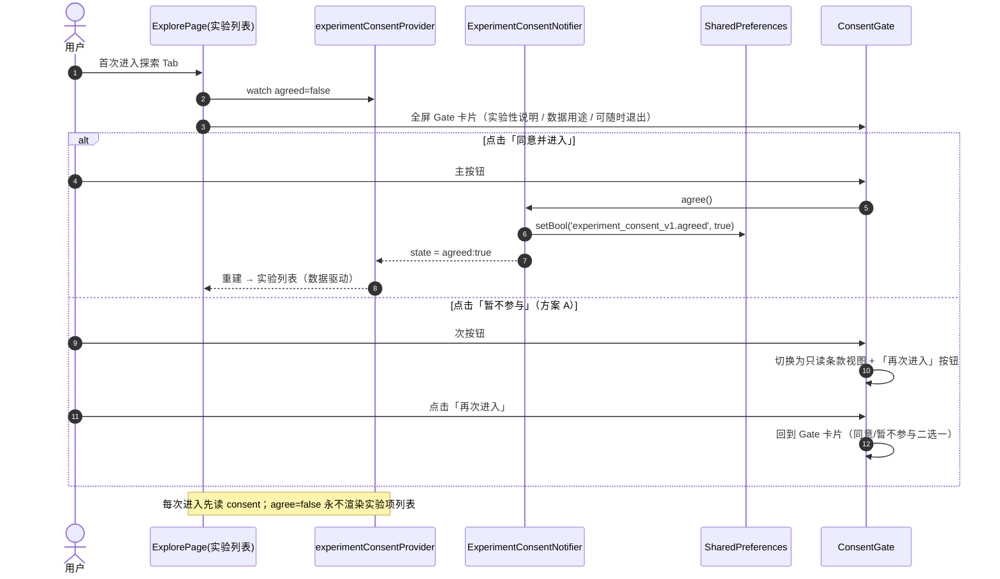
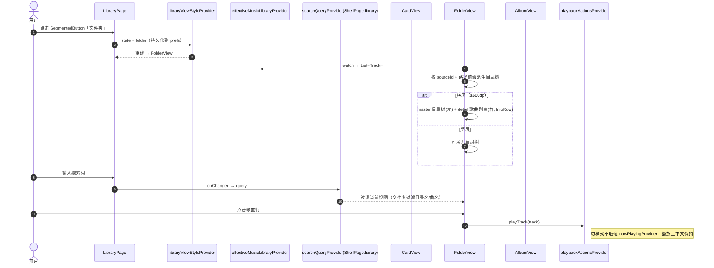
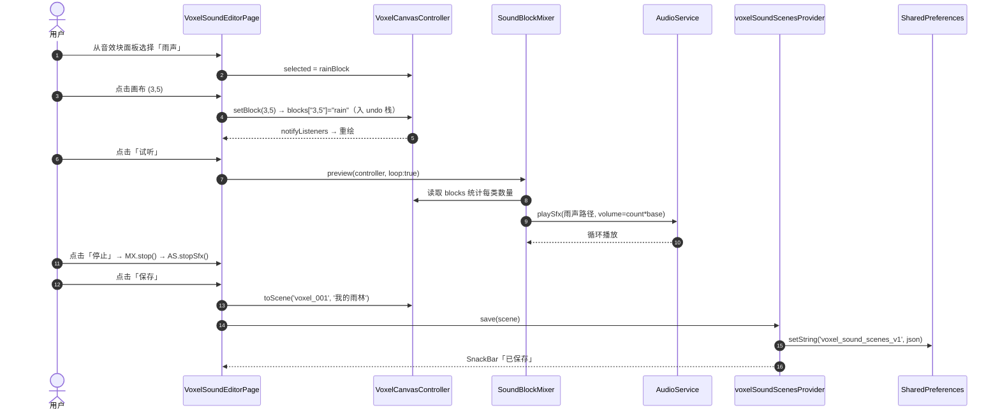
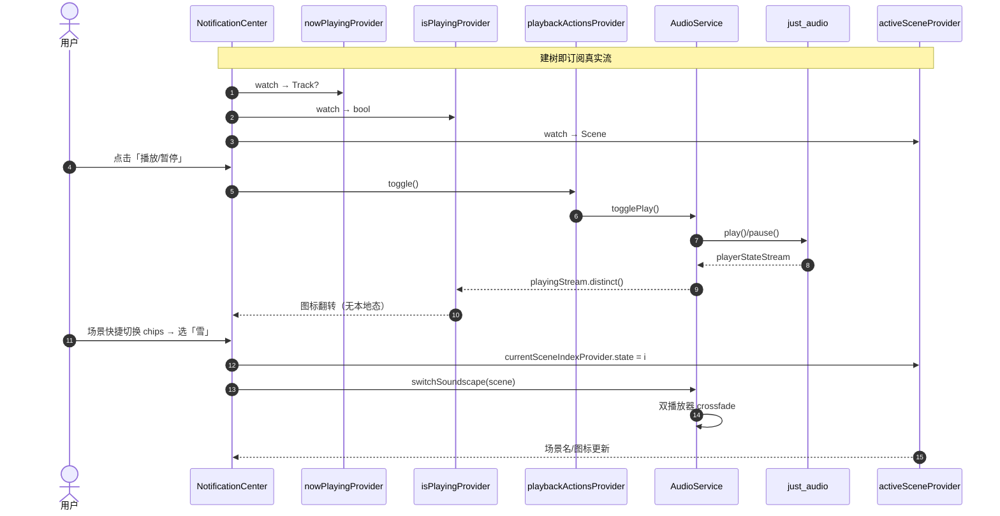
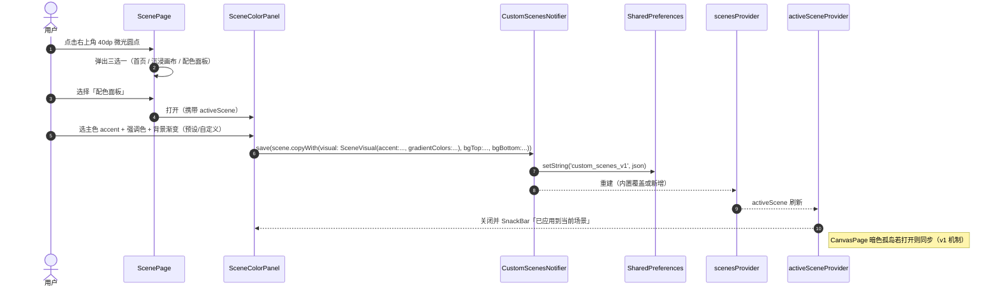
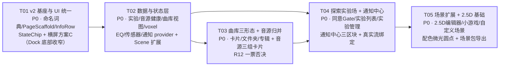

# 星璃音乐空间 · v2 增量架构设计（体验细节迭代）

| 项 | 值 |
|---|---|
| 文档版本 | v2.0 |
| 作者 | 高见远（架构师） |
| 上游输入 | `docs/PRD_V2_增量.md` v2.0 + 用户裁决（①文字色浅色 Token ②调色盘入微光圆点 ③本轮执行体验迭代）+ `docs/ARCHITECTURE_UI_重构.md` v1 + `docs/API_CONTRACT_FROZEN.md` |
| 项目路径 | `D:\Stellara\Music\xingli_music` |
| 技术栈 | Flutter 3.9+ / Riverpod 2.6 / just_audio 0.9 / audio_service 0.18（沿用 v1，不更换） |
| 本文档定位 | 增量文档。**只说变更/新增**，v1 已定稿（浅色 Token、AppDock/MiniPlayer、设置 Master-Detail、Shell 5 页保活、CanvasPage 暗色孤岛）不重复；实现以 v1 + 本设计叠加为准 |

---

## 0. 裁决落盘（本轮唯一依据，无需再议）

| # | 问题 | 裁决 | 架构含义 |
|---|---|---|---|
| ① | 文字色 | **以浅色 Token 为准**（`AppColors.textPrimary/textSecondary/textTertiary`） | 全部新 UI 只从 `AppColors.*` 取字色；暗色孤岛范围不变（仍仅 CanvasPage 子树） |
| ② | 调色盘入口 | **移入场景页右上角 40dp 微光圆点入口** | `ScenePage._showEntrySheet` 二选一 → 三选一（首页 / 沉浸画布 / **配色面板**） |
| ③ | 体验细节 | **本轮即执行** | M1–M6 全部进入本迭代 |
| Q1 | 横屏 Dock | **方案 C**：仅内容区重排，Dock 保持底部**收窄** | 底部条（MiniPlayer + AppDock）横屏居中限宽；内容区做真正的重排（曲库多列 / 文件夹双栏） |
| Q2 | 「暂不参与」 | **方案 A**：只读说明 + 保留可见性 | 未同意时探索页展示只读条款与「再次进入」按钮，不隐藏页面 |
| Q3 | 2.5D | 小游戏与音效编辑器**共享同一 2.5D 渲染基础**；小游戏本轮 = **可玩原型** | 共享 `VoxelCanvasController` + `VoxelCanvasView`（纯 CustomPaint） |
| Q4 | EQ | **UI + 预设**（低/中/高三档 + 4 组预设）；真实 EQ 视平台支持 | Android 用 just_audio `AndroidEqualizer`（已核实：just_audio 0.9 仅 Android 暴露 EQ）；iOS/桌面走**预设模拟层**（状态 + UI + 轻量增益微调，不做 DSP） |
| Q5 | 传感器 | **仅光线 + 加速度**；用于场景亮度 / 摇晃切场景联动；权限说明并入同意 gate 与实验页 | 光线用 `light`（Android-only，降级兜底）、加速度用 `sensors_plus`；权限文案静态展示，不新增系统权限弹窗流程 |

---

## 1. 实现方案与框架选型

> 六模块 + 1 个共享基础。每个模块标注【新增】/【修改】/【复用】。

### M1 · UI 统一与横屏适配 【新增为主，Shell 组件修改】

| 子项 | 策略 | 标注 |
|---|---|---|
| 页面模板 `PageScaffold` | 竖屏：标题(20/w600) + 可选搜索栏(40) + 内容区(弹性)；横屏：可选左信息/导航栏（≤360dp）+ 右侧内容区。5 个 Shell 页与全屏路由页统一接入 | 【新增】 |
| 命名词典 `Terms` | 单文件常量类，全局唯一引用：场景 / 曲库 / 歌曲 / 专辑 / 目录 / 音源 / 服务器 / 通知中心。消灭「服务器 vs 音源」「设置 vs 设定」 | 【新增】 |
| 通用信息组件 `InfoRow` | 封面 48（复用 `TrackCover`）+ 歌名 + 歌手 + 右对齐时长；曲库 / 搜索 / 播放页 / 通知中心 / 专辑详情共用，禁止各页自实现 | 【新增】 |
| 状态徽标 `StateChip` | 实验中 / 稳定 / 已下线 / 连接正常 / 失败 / 连接中；M2 实验项与 M4 音源健康共用 | 【新增】 |
| 横屏断点 | `AppSize.landscapeBreakpoint = 600`（追加到 light_tokens）；页面用 `LayoutBuilder`/宽度判定重排，**禁止整屏等比缩放**（延续 v1 C12） | 【修改】light_tokens |
| Dock / MiniPlayer 横屏 | 方案 C：底部条整体居中限宽（`landscapeDockMaxWidth=560` / `landscapeMiniMaxWidth=760`），内容区真正重排 | 【修改】app_dock / mini_player / app_shell |
| 内容容器横屏 | `ContentContainer` 横屏加最大宽度（≤1200dp 居中），页面各自在容器内重排 | 【修改】content_container |

### M2 · 探索页 = 实验场所 【新增】

- **同意 gate**：`experimentConsentProvider`（StateNotifierProvider）持久化 `agreed`；首次进入展示全屏 Gate 卡片；「同意并进入」→ 实验列表；「暂不参与」→ 只读条款 + 再次进入按钮（方案 A，页面可见性保留）。
- **实验列表容器**：`explore_page.dart` 重写为数据驱动列表（`experimentsProvider` 静态配置表），每项 = 图标 + 名称 + 简介 + `StateChip` 状态 + 进入按钮；「已下线」置灰禁入。
- **实验项页**：A 智能推荐 / B 搜索增强 / C 均衡器 / D 2.5D 小游戏（共享 2.5D 基础，T05 交付）/ E 心情分析 / F 传感器。全屏路由，页内常驻「实验」标识。
- **EQ**：`EqEngine` 抽象 —— `supported` 探测（Android → `AndroidEqualizer`，经 `AudioPlayer(androidAudioEffects: [eq])` 装配）；其余平台 `applySimulation`（仅记录状态 + 可选的音景/音乐增益微调）。
- **传感器**：`SensorService` 封装 `light`（lux，Android-only，onError 兜底）+ `sensors_plus`（加速度）；光线 → 场景亮度遮罩联动、摇晃 → 切下一场景；权限说明静态并入 gate 与实验页。
- **设置·实验管理**：`SettingsSection` 新增第 6 槽「实验」（见待明确 A1 推荐）—— 同意状态 / 撤销同意 / 逐项启停。

### M3 · 曲库三种浏览样式 【新增为主，library_page 重写】

- `LibraryViewStyle {card, folder, album}` + `libraryViewStyleProvider`（持久化）。
- **同源**：三种视图全部 watch `effectiveMusicLibraryProvider` + `searchQueryProvider(ShellPage.library)`；切换样式保留当前播放上下文（`nowPlayingProvider` 不因切视图变化）。
- **卡片**：`AlbumCard` 网格（竖屏 2 列 / 横屏 4 列），封面 72 + 歌名 + 歌手 + 时长，点击即播（走 `playbackActionsProvider.playTrack`）。
- **文件夹**：按 `Track.sourceId` + 本地路径前缀构建目录树；竖屏可展开树（目录名 + 曲目数），横屏 master（左目录树）+ detail（右歌曲列表，复用 `InfoRow`）。
- **专辑**：按 `Track.album` 聚合网格；点开 → `AlbumDetailPage`（`InfoRow` 列表）点击即播。
- 加载 / 错误 / 空态复用 v1 `state_views.dart`（若未落地则由 T03 补建，见 §2 注）。

### M4 · 设置·音源归并 【重构】

- `server_settings_page.dart`（515 行）**瘦身重写**为纯音源管理：三组卡片 = **本地目录 / 自建服务器（Subsonic）/ 公开电台**，每组 = 组标题 + 「添加」 + 条目列表（开关 / 编辑 / 删除 / 测试连接）。
- 迁出非音源区块：全局播放 / 音量（v1 已在「播放」分类）、粒子（「播放」分类）、关于（「关于」分类）——本页直接删除这些区块。
- **健康状态**：`SourceHealth` 模型 + `sourceHealthProvider`（`Map<String, SourceHealth>`），测试时置 `connecting` → 结果 `ok/failed` + `lastTestedAt`；UI 用 `StateChip` 展示；P2 提供一键重试与错误详情。
- **R12 保持**：设置页「音源」分类单入口 → 仍 push `ServerSettingsPage`（瘦身后）。

### M5 · 场景扩展（含 2.5D 编辑器与配色） 【新增为主，模型小改】

> ⚠️ **C-6 演进注**：本节 M5-1 的 2.5D 等距编辑器为**中间态设计**，已被「3D 体素世界」演进取代（`TODO_分派方案.md` G-1/G-3；`voxel_canvas_page.dart` 标注待替换为 3D 体素世界）。阅读本节请叠加 TODO/_draft 的最新意图；M5-2~M5-4（自定义场景 / BGM / 配色面板）仍有效。

| 子项 | 策略 | 标注 |
|---|---|---|
| 2.5D 音效编辑器（M5-1） | 等距/俯视方块画布 + 音效块面板 + 底部工具栏（试听 / 播放 / 撤销 / 重做 / 保存 / 清空）；竖屏画布居中面板在上，横屏画布居左面板居右；基于共享 2.5D 基础 | 【新增】 |
| 自定义场景列表（M5-2） | 内置 / 自定义分组（`scenesProvider` + `customScenesProvider`），来源标记 + 显示开关 + 「+ 新建场景」 | 【新增】 |
| 自定义场景编辑（M5-3） | 名称 / 描述 / 心情 / 图标选择 / **默认 BGM（从曲库选曲）** / 显示开关；扩展既有 `SceneEditorPage` 或新建编辑页（推荐新建轻量页，不动 429 行旧页核心逻辑，旧页保留可达性 R13） | 【新增】+【修改】Scene 模型 |
| 配色个性自定义（M5-4） | 场景页右上角微光圆点 → 三选一弹窗新增「配色面板」→ `SceneColorPanel`（浅色，主色 / 强调色 / 背景渐变，预设色板 + 自定义取色）→ `customScenesProvider.save(scene.copyWith(...))` 持久化 | 【新增】+【修改】scene_page |
| 导出 / 导入场景包（P1） | 复用 `scenes/scene_packer.dart` / `scene_api.dart` / `scene_deploy.dart`，自定义场景与 2.5D 音效场景均可打包 | 【复用】 |

**Scene 模型增量字段**（向后兼容，默认值不破坏既有 JSON）：

```dart
final bool visible;            // 默认 true；false = 列表中隐藏
final String? bgmUri;          // 默认 BGM 曲目地址（从曲库选择）
final String? bgmTitle;
final String? bgmArtist;
```

### M5 附 · 共享 2.5D 渲染基础（M2-D 小游戏 + M5-1 编辑器） 【新增】

> **纯 Flutter CustomPaint 实现，零第三方 3D 依赖。** 等距投影为 2D 数学变换，不引入 game engine。

| 类 | 职责 |
|---|---|
| `VoxelBlockType` | 音效块预设：id / 名称 / 图标 / sfxKey（对应音效资源）/ baseVolume / 颜色 |
| `VoxelSoundScene` | 保存模型：id / name / `Map<"x,y", blockTypeId>`，toJson/fromJson |
| `VoxelCanvasController`（ChangeNotifier） | 网格尺寸、方块表、当前选中类型、add/remove/undo/redo/clear、load/toScene |
| `VoxelCanvasView`（CustomPaint） | 等距菱形瓦片 + 顶面/左右侧面绘制、选中高亮、手势命中（像素 → 网格坐标） |
| `SoundBlockMixer` | 按方块数量/位置混合：每类 count → 音量，x 位置 → 左右声道权重（可选）；经既有 `AudioService.playSfx` 一次性/循环播放；preview/stop |

**小游戏（M2-D）可玩原型**：同控制器 + 玩家方块 + `Ticker` 游戏循环（移动 / 收集音效块 / 计分），不追求完整游戏循环。

### M6 · 通知中心（多合一） 【新增为主】

- `notification_providers.dart` 把 settings_page 内 3 个私有 `StateProvider`（后台播放 / 锁屏控件 / 通知栏）**上提为共享 provider**，并新增 `recentNotificationsProvider`（事件日志，P2）。
- `NotificationCenter` 组件：三区块卡片 —— ① 运行状态（3 开关）；② 媒体控制（封面 + 歌名/歌手 + 播放暂停/上一首/下一首 + 进度条）；③ 场景状态（当前场景图标/名称 + 音景开关 + 场景快捷切换 chips）。
- **播放控制真实流绑定（P0-M6-2 硬约束）**：只读 `isPlayingProvider` / `nowPlayingProvider` / `musicPositionProvider` / `musicDurationProvider`；动作只走 `playbackActionsProvider`（延续 v1 C6/C7）。
- 横屏（P2-M1-7）：② 与 ③ 并排双列。

---

## 2. 文件列表（按模块分组）

> 标注：【新增】= 新建；【修改】= 改既有文件；【复用】= 零改动直接使用。
> ⚠️ 说明：v1 文件清单中的 `widgets/common/album_card.dart`、`widgets/common/state_views.dart` **未在磁盘落地**（`find` 已核验，`lib/widgets/common/` 仅有 playback_feedback / track_cover），故本轮按【新增】处理。

### M1 · UI 统一 + 横屏

| # | 路径 | 标注 | 职责 |
|---|---|---|---|
| 1 | `lib/core/terms/naming_dict.dart` | 新增 | 命名词典 `Terms`（8 个实体 + 常用动词） |
| 2 | `lib/widgets/common/page_scaffold.dart` | 新增 | `PageScaffold` 统一页面模板 |
| 3 | `lib/widgets/common/info_row.dart` | 新增 | `InfoRow`（封面 48 + 歌名 + 歌手 + 时长） |
| 4 | `lib/widgets/common/state_chip.dart` | 新增 | `StateChip` + `ChipTone` 枚举 |
| 5 | `lib/core/theme/light_tokens.dart` | 修改 | 追加 `landscapeBreakpoint=600`、`landscapeDockMaxWidth=560`、`landscapeMiniMaxWidth=760`、`infoCover=48` 等 |
| 6 | `lib/widgets/shell/app_dock.dart` | 修改 | 横屏收窄（居中限宽） |
| 7 | `lib/widgets/shell/mini_player.dart` | 修改 | 横屏限宽 |
| 8 | `lib/widgets/shell/content_container.dart` | 修改 | 横屏最大宽度 1200dp 居中 |
| 9 | `lib/app_shell.dart` | 修改 | 横屏底部条接线（方案 C） |
| 10 | `lib/pages/scene/scene_page.dart` | 修改 | PageScaffold 接入 + 微光圆点三选一（配色入口，T05 联动） |
| 11 | `lib/pages/explore/explore_page.dart` | 修改 | PageScaffold 接入（T04 重写实验列表时一并） |
| 12 | `lib/pages/library/library_page.dart` | 修改 | PageScaffold 接入（T03 三形态重写时一并） |
| 13 | `lib/pages/settings/settings_page.dart` | 修改 | PageScaffold 接入 |
| 14 | `lib/pages/home/home_page.dart` | 修改 | PageScaffold 接入（无搜索栏，延续 v1 P0-C4） |

### M2 · 探索实验场

| # | 路径 | 标注 | 职责 |
|---|---|---|---|
| 15 | `lib/models/experiment.dart` | 新增 | `ExperimentStatus` / `ExperimentItem` / `ExperimentConsent` |
| 16 | `lib/providers/explore/experiment_providers.dart` | 新增 | consent（持久化）+ enabled 表 + `experimentsProvider` 配置 |
| 17 | `lib/pages/explore/consent_gate.dart` | 新增 | 同意 Gate（方案 A） |
| 18 | `lib/pages/explore/experiments/recommend_page.dart` | 新增 | 实验 A 智能推荐 / 智能音景 |
| 19 | `lib/pages/explore/experiments/search_page.dart` | 新增 | 实验 B 跨源 / 模糊搜索增强 |
| 20 | `lib/pages/explore/experiments/equalizer_page.dart` | 新增 | 实验 C EQ（3 档 + 4 预设） |
| 21 | `lib/pages/explore/experiments/mood_analysis_page.dart` | 新增 | 实验 E 心情分析（问卷 → 心情匹配） |
| 22 | `lib/pages/explore/experiments/sensor_page.dart` | 新增 | 实验 F 传感器（光线 / 加速度 → 场景联动） |
| 23 | `lib/services/audio/eq_engine.dart` | 新增 | `EqEngine` 抽象（Android 真 EQ / 模拟层） |
| 24 | `lib/providers/audio/equalizer_providers.dart` | 新增 | EQ 状态 + 预设表 |
| 25 | `lib/services/sensor/sensor_service.dart` | 新增 | `SensorService`（light + accelerometer） |
| 26 | `lib/providers/explore/sensor_providers.dart` | 新增 | lux / shake 流 provider + 联动逻辑 |
| 27 | `lib/providers/settings/settings_ui_providers.dart` | 修改 | `SettingsSection` 新增 `experiment` 槽位（见待明确 A1） |

> 实验 D（2.5D 小游戏）页面在 T05 交付（与 M5-1 共享 2.5D 基础）。

### M3 · 曲库三形态

| # | 路径 | 标注 | 职责 |
|---|---|---|---|
| 28 | `lib/providers/library/library_view_providers.dart` | 新增 | `LibraryViewStyle` + 持久化 provider |
| 29 | `lib/models/library_folder.dart` | 新增 | 目录树节点模型（由 tracks 派生） |
| 30 | `lib/widgets/common/album_card.dart` | 新增 | 卡片视图卡（封面 72 + 3 行文本） |
| 31 | `lib/widgets/common/state_views.dart` | 新增 | `LoadingView` / `ErrorView` / `EmptyView`（v1 清单未落地，本轮补建） |
| 32 | `lib/pages/library/library_page.dart` | 修改（重写） | 三形态切换器 + 三视图调度 + 搜索过滤 |
| 33 | `lib/pages/library/album_detail_page.dart` | 新增 | 专辑曲目列表（复用 InfoRow） |
| 34 | `lib/widgets/library/card_view.dart` | 新增 | 卡片视图（网格 2/4 列） |
| 35 | `lib/widgets/library/folder_view.dart` | 新增 | 文件夹视图（树 / 横屏 master-detail） |
| 36 | `lib/widgets/library/album_view.dart` | 新增 | 专辑视图（网格 + 跳详情） |

### M4 · 音源归并

| # | 路径 | 标注 | 职责 |
|---|---|---|---|
| 37 | `lib/models/source_health.dart` | 新增 | `SourceHealthStatus` / `SourceHealth` |
| 38 | `lib/providers/audio/source_health_providers.dart` | 新增 | 健康状态表（连接中 / ok / failed / lastTestedAt） |
| 39 | `lib/pages/settings/server_settings_page.dart` | 修改（瘦身重写） | 三组音源卡片（本地目录 / Subsonic / 电台），删非音源区块 |
| 40 | `lib/pages/settings/settings_page.dart` | 修改 | 「音源」分类单入口（R12 保持） |

### M5 · 场景扩展 + 2.5D

| # | 路径 | 标注 | 职责 |
|---|---|---|---|
| 41 | `lib/models/voxel.dart` | 新增 | `VoxelBlockType` / `VoxelSoundScene` |
| 42 | `lib/widgets/voxel/voxel_canvas_controller.dart` | 新增 | `VoxelCanvasController`（ChangeNotifier） |
| 43 | `lib/widgets/voxel/voxel_canvas_view.dart` | 新增 | `VoxelCanvasView` + 内部等距 painter |
| 44 | `lib/services/audio/sound_block_mixer.dart` | 新增 | `SoundBlockMixer`（数量/位置 → 混音） |
| 45 | `lib/providers/scene/voxel_scene_providers.dart` | 新增 | 2.5D 音效场景持久化（prefs） |
| 46 | `lib/pages/scene/voxel_sound_editor_page.dart` | 新增 | 2.5D 音效编辑器（M5-1） |
| 47 | `lib/pages/scene/custom_scene_list_page.dart` | 新增 | 自定义场景列表（M5-2） |
| 48 | `lib/pages/scene/custom_scene_edit_page.dart` | 新增 | 自定义场景编辑（M5-3：名称/描述/心情/图标/显示/BGM 选曲） |
| 49 | `lib/widgets/scene/scene_color_panel.dart` | 新增 | 浅色配色面板（M5-4） |
| 50 | `lib/models/scene.dart` | 修改 | `visible` + `bgmUri/bgmTitle/bgmArtist`（默认值向后兼容） |
| 51 | `lib/pages/scene/scene_page.dart` | 修改 | 微光圆点三选一（加「配色面板」） |
| 52 | `lib/providers/scene/scene_custom_providers.dart` | 修改 | 保存时保留 `visible`（无需改逻辑，Scene 序列化自带） |
| 53 | `lib/pages/explore/experiments/voxel_minigame_page.dart` | 新增 | 2.5D 小游戏（M2-D，可玩原型） |
| 54 | `lib/scenes/scene_packer.dart` / `scene_api.dart` / `scene_deploy.dart` | 复用 | 场景包导出 / 导入（P1-M5-6） |

### M6 · 通知中心

| # | 路径 | 标注 | 职责 |
|---|---|---|---|
| 55 | `lib/models/notification_event.dart` | 新增 | `NotificationEvent`（P2 事件日志） |
| 56 | `lib/providers/settings/notification_providers.dart` | 新增 | 3 开关上提 + `recentNotificationsProvider` |
| 57 | `lib/widgets/notification/notification_center.dart` | 新增 | 三区块卡片（横屏双列） |
| 58 | `lib/pages/settings/settings_page.dart` | 修改 | 「通知」分类渲染 `NotificationCenter` |

**汇总**：新增 38 · 修改 12 · 复用 3 · 删除 0。

---

## 3. 数据结构与接口

### 3.1 类图（新增 / 变更核心）

```mermaid
classDiagram
    direction LR

    %% ══════ M1 统一层（新增）══════
    class Terms {
        <<abstract final>>
        +String scene$ "场景"
        +String library$ "曲库"
        +String track$ "歌曲"
        +String album$ "专辑"
        +String folder$ "目录"
        +String source$ "音源"
        +String server$ "服务器"
        +String notificationCenter$ "通知中心"
    }
    class PageScaffold {
        <<StatelessWidget>>
        +String title
        +Widget? search
        +Widget? leadingPanel
        +Widget body
        +Widget build(context)
    }
    class InfoRow {
        <<StatelessWidget>>
        +Track? track
        +VoidCallback? onTap
        +Widget build(context)
    }
    class StateChip {
        <<StatelessWidget>>
        +ChipTone tone
        +String label
        +Widget build(context)
    }
    class ChipTone {
        <<enumeration>>
        experimenting
        stable
        retired
        connecting
        ok
        failed
    }
    PageScaffold --> InfoRow : 复用
    PageScaffold ..> Terms : 文案引用

    %% ══════ M2 实验（新增）══════
    class ExperimentStatus {
        <<enumeration>>
        experimenting
        stable
        retired
    }
    class ExperimentItem {
        +String id
        +String name
        +String description
        +IconData icon
        +ExperimentStatus status
        +bool enabledByDefault
        +Widget Function() builder
    }
    class ExperimentConsent {
        +bool agreed
        +Map~String,bool~ enabled
    }
    class ExperimentConsentNotifier {
        +Future~void~ agree()
        +Future~void~ revoke()
        +Future~void~ setEnabled(String id, bool on)
    }
    ExperimentItem ..> ExperimentStatus
    ExperimentConsentNotifier ..> ExperimentConsent

    %% ══════ M3 曲库三形态（新增）══════
    class LibraryViewStyle {
        <<enumeration>>
        card
        folder
        album
    }
    class LibraryFolderNode {
        +String name
        +String pathKey
        +List~LibraryFolderNode~ children
        +List~Track~ tracks
        +int get trackCount
    }

    %% ══════ M4 音源健康（新增）══════
    class SourceHealthStatus {
        <<enumeration>>
        connecting
        ok
        failed
        unknown
    }
    class SourceHealth {
        +SourceHealthStatus status
        +DateTime? lastTestedAt
        +String? errorDetail
    }
    SourceHealth ..> SourceHealthStatus

    %% ══════ M5 + 2.5D 共享基础（新增）══════
    class VoxelBlockType {
        +String id
        +String name
        +IconData icon
        +String sfxKey
        +double baseVolume
        +Color color
    }
    class VoxelSoundScene {
        +String id
        +String name
        +Map~String,String~ blocks
        +Map~String,dynamic~ toJson()$
        +factory VoxelSoundScene.fromJson()$
    }
    class VoxelCanvasController {
        <<ChangeNotifier>>
        +int cols
        +int rows
        +Map~String,String~ blocks
        +VoxelBlockType selected
        +void setBlock(int x, int y)
        +void removeBlock(int x, int y)
        +void undo()
        +void redo()
        +void clear()
        +void load(VoxelSoundScene scene)
        +VoxelSoundScene toScene(String id, String name)
    }
    class VoxelCanvasView {
        <<CustomPaint widget>>
        +VoxelCanvasController controller
        +VoidCallback? onTapBlock
        +Widget build(context)
    }
    class SoundBlockMixer {
        +Future~void~ preview(VoxelCanvasController ctrl, {bool loop})
        +Future~void~ stop()
    }
    VoxelCanvasView --> VoxelCanvasController
    VoxelCanvasController *-- VoxelBlockType : selected
    SoundBlockMixer --> VoxelCanvasController

    %% ══════ EQ（新增）══════
    class EqPreset {
        +String id
        +String name
        +double low
        +double mid
        +double high
    }
    class EqEngine {
        +bool get supported
        +Future~void~ apply(EqPreset preset)
        +void applySimulation(EqPreset preset)
    }
    EqEngine ..> EqPreset

    %% ══════ 传感器（新增）══════
    class SensorService {
        +Stream~double~ lightLux()
        +Stream~bool~ shakeDetected()
        +void dispose()
    }

    %% ══════ M6 通知（新增）══════
    class NotificationEvent {
        +String id
        +String title
        +String message
        +DateTime at
    }

    %% ══════ v2 Provider 层（新增/修改）══════
    class V2Providers {
        <<library>>
        +StateNotifierProvider~ExperimentConsentNotifier,ExperimentConsent~ experimentConsentProvider$
        +Provider~List~ExperimentItem~~ experimentsProvider$
        +StateProvider~LibraryViewStyle~ libraryViewStyleProvider$
        +StateNotifierProvider~SourceHealthNotifier,Map~String,SourceHealth~~ sourceHealthProvider$
        +StateNotifierProvider~VoxelScenesNotifier,List~VoxelSoundScene~~ voxelSoundScenesProvider$
        +StateNotifierProvider~NotificationNotifier,List~NotificationEvent~~ recentNotificationsProvider$
        +StateProvider~bool~ backgroundPlayProvider$
        +StateProvider~bool~ lockScreenProvider$
        +StateProvider~bool~ notificationBarProvider$
        +Provider~EqEngine~ eqEngineProvider$
        +Provider~SensorService~ sensorServiceProvider$
        +StateProvider~EqPreset~ eqPresetProvider$
    }
    V2Providers ..> ExperimentItem
    V2Providers ..> LibraryViewStyle
    V2Providers ..> SourceHealth
    V2Providers ..> VoxelSoundScene
    V2Providers ..> NotificationEvent
    V2Providers ..> EqEngine
    V2Providers ..> SensorService

    %% ══════ 既有模型变更 ══════
    class Scene {
        <<existing · modified>>
        +bool visible
        +String? bgmUri
        +String? bgmTitle
        +String? bgmArtist
    }
    class SettingsSection {
        <<existing enum · modified>>
        playback
        source
        scene
        notification
        about
        experiment  "+ 新增第 6 槽"
    }
```

### 3.2 关键接口契约

#### 3.2.1 `PageScaffold`（M1 统一模板）

```dart
PageScaffold(
  title: Terms.library,                    // 命名词典
  search: AppSearchBar(hintText: ..., query: ..., onChanged: ...), // 可选
  leadingPanel: ...,                        // 横屏可选左栏（≤360dp）
  body: ...,                               // 内容区（弹性）
)
```

#### 3.2.2 实验清单数据驱动格式（P0-M2-2）

```dart
final experimentsProvider = Provider<List<ExperimentItem>>((ref) => [
  ExperimentItem(
    id: 'recommend', name: '智能推荐', description: '按当前场景情绪推荐曲目',
    icon: Icons.auto_awesome_rounded, status: ExperimentStatus.experimenting,
    builder: () => const RecommendPage(),
  ),
  ExperimentItem(
    id: 'search', name: '跨源搜索', ... status: ExperimentStatus.stable,
    builder: () => const SearchExperimentPage(),
  ),
  ExperimentItem(
    id: 'equalizer', name: '音效均衡器', ... status: ExperimentStatus.experimenting,
    builder: () => const EqualizerPage(),
  ),
  ExperimentItem(
    id: 'voxel_game', name: '2.5D 小游戏', ... status: ExperimentStatus.experimenting,
    builder: () => const VoxelMinigamePage(),   // T05 交付
  ),
  ExperimentItem(
    id: 'mood', name: '心情分析', ... status: ExperimentStatus.stable,
    builder: () => const MoodAnalysisPage(),
  ),
  ExperimentItem(
    id: 'sensor', name: '传感器', ... status: ExperimentStatus.experimenting,
    builder: () => const SensorPage(),
  ),
  // 示例：已下线
  // ExperimentItem(id: 'old_x', ..., status: ExperimentStatus.retired, ...),
]);
```

#### 3.2.3 2.5D 控制器坐标约定（共享基础）

- 网格坐标：`(col, row)`，`col ∈ [0, cols)`，`row ∈ [0, rows)`；序列化 key = `"$col,$row"`。
- 等距投影：`screenX = (col - row) * tileW / 2 + offsetX`，`screenY = (col + row) * tileH / 2 + offsetY`；命中逆变换取整。
- `VoxelSoundScene.toJson`：`{'id','name','cols','rows','blocks': {'x,y': typeId}}`。

#### 3.2.4 EQ 接口（Q4 落盘）

```dart
/// 4 组预设
enum EqPresetId { flat, bass, vocal, treble }
class EqPreset { final String id; final String name; final double low, mid, high; }
// 默认：flat(0,0,0) / bass(+6,0,-3) / vocal(-2,+4,-1) / treble(-3,0,+6)（dB）

abstract class EqEngine {
  bool get supported;                    // Android true；iOS/桌面 false
  Future<void> apply(EqPreset p);        // Android: AndroidEqualizer 真 EQ
  void applySimulation(EqPreset p);      // 其余平台：仅状态 + 可选增益微调
}
```

#### 3.2.5 通知中心绑定（P0-M6-2 硬约束）

| 区块 | 读取（watch） | 动作（read） |
|---|---|---|
| ② 播放控制 | `nowPlayingProvider` / `isPlayingProvider` / `musicPositionProvider` / `musicDurationProvider` | `playbackActionsProvider.toggle()/next()/playTrack()`；进度拖动 → `audioServiceProvider.seek()` |
| ③ 场景状态 | `activeSceneProvider` / `sceneOrderProvider` / `currentSceneIndexProvider` | 切场景 → `currentSceneIndexProvider.notifier.state = i` + `audioServiceProvider.switchSoundscape(scene)` |

---

## 4. 程序调用流程

### 4.1 探索同意 gate 流（P0-M2-1，方案 A）



### 4.2 曲库三形态切换流（P0-M3-1/5）



### 4.3 2.5D 编辑器保存流（P0-M5-1）



### 4.4 通知中心与播放流绑定流（P0-M6-2）



### 4.5 配色自定义应用流（M5-4，经微光圆点）



---

## 5. 任务列表（有序，5 个）

> 所有任务共享 §7「共享知识」。每个任务结束跑 `flutter analyze` 保证无 error。
> 依赖遵循 PRD：`M1 → M4 → M6`；`M1 → M3 → M2 → M5`；M2-D 与 M5-1 共享 2.5D 基础（合入 T05）。

### T01 · v2 基座与 UI 统一（M1）【P0】【无依赖】

| 项 | 内容 |
|---|---|
| **涉及文件** | 新增：`core/terms/naming_dict.dart`、`widgets/common/page_scaffold.dart`、`widgets/common/info_row.dart`、`widgets/common/state_chip.dart`；修改：`core/theme/light_tokens.dart`、`widgets/shell/app_dock.dart`、`widgets/shell/mini_player.dart`、`widgets/shell/content_container.dart`、`app_shell.dart`、5 页接入 PageScaffold（scene/explore/library/settings/home） |
| **依赖** | 无 |
| **验收要点** | ① 全页面走查表成立：组件/间距/文案单一出处；② 命名词典 `Terms.*` 全局唯一引用，页面无硬编码实体文案；③ `InfoRow` 唯一实现，曲库/搜索/播放页共用；④ 横屏（宽 ≥600dp）无 RenderFlex overflow，曲库网格列数/探索列表列数随宽度调整；⑤ Dock 方案 C：底部居中收窄（`landscapeDockMaxWidth=560`）；⑥ 320/360/390/430dp 竖屏无回归；⑦ `flutter analyze` 无 error |

### T02 · v2 数据与状态层（全模块模型 + provider）【P0】【依赖 T01】

| 项 | 内容 |
|---|---|
| **涉及文件** | 新增：`models/experiment.dart`、`providers/explore/experiment_providers.dart`、`models/source_health.dart`、`providers/audio/source_health_providers.dart`、`models/library_folder.dart`、`providers/library/library_view_providers.dart`、`models/voxel.dart`、`providers/scene/voxel_scene_providers.dart`、`models/notification_event.dart`、`providers/settings/notification_providers.dart`、`services/audio/eq_engine.dart`、`providers/audio/equalizer_providers.dart`、`services/sensor/sensor_service.dart`、`providers/explore/sensor_providers.dart`、`services/audio/sound_block_mixer.dart`；修改：`models/scene.dart`（visible/bgm 字段）、`providers/settings/settings_ui_providers.dart`（+experiment 槽位） |
| **依赖** | T01 |
| **验收要点** | ① 全部新模型 toJson/fromJson 可往返（含 Scene 新字段默认值兼容旧数据）；② consent / 视图样式 / voxel 场景 / 通知开关均可持久化；③ `EqEngine.supported` 平台判定正确（Android true）；④ `SensorService` 订阅/退订无泄漏（dispose）；⑤ `SettingsSection` 6 槽枚举与元数据就位；⑥ `flutter analyze` 无 error |

### T03 · 曲库三形态 + 音源归并（M3 + M4）【P0】【依赖 T01, T02】

| 项 | 内容 |
|---|---|
| **涉及文件** | 新增：`widgets/common/album_card.dart`、`widgets/common/state_views.dart`、`widgets/library/card_view.dart`、`widgets/library/folder_view.dart`、`widgets/library/album_view.dart`、`pages/library/album_detail_page.dart`；修改（重写）：`pages/library/library_page.dart`、`pages/settings/server_settings_page.dart`、`pages/settings/settings_page.dart`（音源单入口） |
| **依赖** | T01, T02 |
| **验收要点** | ① 三形态切换器（SegmentedButton）可用且当前样式持久化；② 卡片 2/4 列、文件夹目录树、专辑聚合 + 详情页全部点击即播且迷你播放器同步；③ 搜索在三种样式下过滤当前视图；④ 切换样式播放上下文保持；⑤ `server_settings_page` 瘦身为三组音源卡片（本地目录/Subsonic/电台），全局播放/粒子/关于区块已删除；⑥ **R12 一票否决：设置 → 音源 → 可配置服务器**；⑦ 音源条目健康状态 `StateChip`（连接中/正常/失败 + 上次测试时间）；⑧ 加载/错误/空态三件套一致；⑨ `flutter analyze` 无 error |

### T04 · 探索实验场 + 通知中心（M2 + M6）【P0】【依赖 T02, T03】

| 项 | 内容 |
|---|---|
| **涉及文件** | 新增：`pages/explore/consent_gate.dart`、`pages/explore/experiments/{recommend,search,equalizer,mood_analysis,sensor}_page.dart`、`widgets/notification/notification_center.dart`；修改（重写）：`pages/explore/explore_page.dart`（实验列表容器）、`pages/settings/settings_page.dart`（实验管理 section + 通知分类渲染 NotificationCenter） |
| **依赖** | T02（数据），T03（settings_page 文件交叠，推荐串行） |
| **验收要点** | ① 首次进入出现同意 Gate；「暂不参与」→ 只读条款 + 再次进入（方案 A）；同意持久化；② 实验列表数据驱动，每项状态 `StateChip`，「已下线」置灰禁入；③ 设置「实验」分类：查看同意状态 / 撤销同意 / 逐项启停；④ 实验页内隐私说明（传感器/心情本地处理）展示；⑤ 通知中心三区块齐全；⑥ **播放控制绑定真实流**（`isPlayingProvider`/`nowPlayingProvider`），锁屏关闭时应用内控制仍可用；⑦ 场景快捷切换生效并联动音景；⑧ `flutter analyze` 无 error |

### T05 · 场景扩展 + 2.5D 渲染基础（M5 + M2-D）【P0（含 P1 子项）】【依赖 T02, T03, T04】

| 项 | 内容 |
|---|---|
| **涉及文件** | 新增：`widgets/voxel/voxel_canvas_controller.dart`、`widgets/voxel/voxel_canvas_view.dart`、`pages/scene/voxel_sound_editor_page.dart`、`pages/scene/custom_scene_list_page.dart`、`pages/scene/custom_scene_edit_page.dart`、`widgets/scene/scene_color_panel.dart`、`pages/explore/experiments/voxel_minigame_page.dart`；修改：`pages/scene/scene_page.dart`（微光圆点三选一）、`pages/settings/scene_editor_page.dart`（如需显示/BGM 字段，否则保留 R13 原样） |
| **依赖** | T02（voxel 数据），T03（T04 已建实验 D 入口，页面在此落地） |
| **验收要点** | ① 2.5D 编辑器：可放置/删除音效块、试听（按数量/位置混音）、撤销/重做/清空、保存为 2.5D 音效场景；② 竖屏/横屏布局符合（画布↔面板方位）；③ 2.5D 小游戏可玩原型（玩家方块移动 + 收集音效块 + 计分）；④ 自定义场景列表（内置/自定义分组 + 来源标记 + 显示开关 + 新建）；⑤ 编辑自定义场景含默认 BGM 选曲（从曲库）；⑥ 微光圆点 → 配色面板 → 应用到当前场景并持久化（写入 `Scene.visual`/`bgTop`/`bgBottom`/`accent`）；⑦ P1：撤销/重做、场景包导出/导入（复用 scene_packer）；⑧ `flutter analyze` 无 error |

### 任务依赖图



---

## 6. 依赖包列表（新增）

| 包 | 版本 | 用途 | 必要性 |
|---|---|---|---|
| `sensors_plus` | ^7.0.0 | 加速度传感器（摇晃切场景），Android/iOS 均支持 | 必需（实验 F） |
| `light` | ^3.0.0 | 环境光传感器 lux（**仅 Android**，iOS/桌面 onError 兜底为 null） | 必需（实验 F；降级设计） |

> 2.5D 渲染：**纯 Flutter `CustomPaint` 实现**，零第三方 3D/游戏引擎依赖。
> EQ：**不新增依赖** —— just_audio 0.9 内置 `AndroidEqualizer`（仅 Android，需以 `AudioPipeline(androidAudioEffects: [eq])` 装配）；iOS/桌面走 `EqEngine.applySimulation` 模拟层。
> 其余沿用 v1：flutter_riverpod / just_audio / audio_service / audioplayers / shared_preferences / on_audio_query / permission_handler 等。
> iOS 运动传感器需在 `ios/Runner/Info.plist` 加 `NSMotionUsageDescription`（一次性配置，非依赖）。

---

## 7. 共享知识（跨文件强制约定）

### 7.1 命名词典（M1 单一出处）
```dart
// lib/core/terms/naming_dict.dart
abstract final class Terms {
  static const String scene = '场景';
  static const String library = '曲库';
  static const String track = '歌曲';
  static const String album = '专辑';
  static const String folder = '目录';
  static const String source = '音源';
  static const String server = '服务器';
  static const String notificationCenter = '通知中心';
}
```
**规则**：页面文案不得硬编码实体名词；「服务器 vs 音源」「设置 vs 设定」一律以 `Terms.*` 为准。

### 7.2 `PageScaffold` 用法
- 5 个 Shell 页统一：`PageScaffold(title: Terms.*, search: 可选, body: ...)`；全屏路由页（实验页/编辑器/通知中心子页）同样接入。
- 横屏时 `leadingPanel`（≤360dp）可选；搜索栏置于右侧内容区顶部（PRD §4.1）。

### 7.3 `InfoRow` 用法
- 唯一信息行：`InfoRow(track: t, onTap: ...)` → 封面 48（`TrackCover`）+ 歌名 + 歌手 + 右对齐时长。
- 禁止在曲库/搜索/播放页/通知中心/专辑详情自行拼行。

### 7.4 `StateChip` 用法
- `StateChip(tone: ChipTone.experimenting, label: '实验中')`。
- tone 映射：experimenting→「实验中」/ stable→「稳定」/ retired→「已下线」/ connecting→「连接中」/ ok→「正常」/ failed→「失败」。
- M2 实验状态与 M4 音源健康共用；「已下线」附带置灰 + 禁入逻辑（由外层判断，不在 Chip 内）。

### 7.5 横屏断点与布局
- 唯一断点：`AppSize.landscapeBreakpoint = 600`（宽 ≥600dp 即横屏布局）。
- 方案 C：底部条（MiniPlayer + AppDock）始终在底部、居中限宽（560/760dp）；**内容区重排**，禁止整屏等比缩放（延续 v1 C12）。
- 网格列数：曲库卡片 2→4、专辑 2→4、探索实验列表 ≥2，用 `SliverGridDelegateWithMaxCrossAxisExtent` 或宽度判定。

### 7.6 实验数据驱动格式（P0-M2-2）
- 实验清单 = `experimentsProvider` 静态配置表（id/name/desc/icon/status/builder），**不硬编码在 UI**。
- 状态机：`agreed=false` 永不渲染实验项；`retired` 置灰禁入。
- 同意状态持久化 key：`experiment_consent_v1`（JSON：`{agreed, enabled:{...}}`）。

### 7.7 2.5D 坐标与序列化（共享基础）
- 网格 key：`"$col,$row"`；等距投影公式见 §3.2.3。
- `VoxelSoundScene` JSON：`{'id','name','cols','rows','blocks'}`；持久化 key：`voxel_sound_scenes_v1`。

### 7.8 播放/通知状态真源铁律（延续 v1 C6/C7）
- 通知中心与所有 UI 的播放态只来自 `isPlayingProvider` / `nowPlayingProvider` / `musicPositionProvider` / `musicDurationProvider`；动作只走 `playbackActionsProvider`；禁止本地 setState 推断。
- `playbackActionsProvider` 返回值非空 → `SnackBar` 消费（延续 C8）。

### 7.9 取色 / 尺寸铁律（延续 v1 C1/C2）
- 颜色只从 `AppColors.*`；尺寸/圆角/间距从 Token；暗色孤岛豁免范围不变（CanvasPage 子树 + 场景数据默认色）。
- `Scene.visual` / `bgTop` / `bgBottom` / `accent` 属于**场景数据**（配色持久化目标），不是 UI 色，允许存 `Color(0x...)`。

### 7.10 传感器权限说明
- 同意 Gate 与实验页内固定文案：光线 / 加速度数据**本地处理，不上传**；如需上传须二次授权（P1-M2-6）。
- `SensorService` 订阅必须 `dispose()` 取消，防泄漏/耗电。

---

## 8. 待明确事项（≤5，附推荐）

| # | 问题 | 影响 | 推荐 |
|---|---|---|---|
| **A1** | 设置页「实验」管理入口：新增第 6 分类槽位 vs 放入「关于」子入口 | 改变 v1「5 tile」Master-Detail 结构 | **新增第 6 槽「实验」**（rail 是 ListView 可扩展，且搜索/管理更顺）；如主理人希望最小化改动，退回「关于」子入口 |
| **A2** | 2.5D 音效保存后的播放形态：独立音效层 vs 写入 `Scene.soundscapePath` | 与既有音景（程序合成/ambient）的优先级 | **独立音效层**：保存为 `VoxelSoundScene`，编辑后可「应用为当前场景音效」，作为音景之上的叠加层播放（不入 `Scene.soundscapePath`，避免污染既有场景数据） |
| **A3** | EQ 模拟层（iOS/桌面）的「模拟」程度：仅状态+UI vs 轻量增益 | Q4 落盘 | **仅状态 + UI + 可选整体增益微调**，不做 DSP（诚实标注「当前平台不支持真实 EQ」），Android 走 `AndroidEqualizer` 真 EQ |
| **A4** | 光线传感器 `light` 包仅 Android：桌面/Windows 开发时如何演示实验 F | 实验 F 在桌面端无 lux | lux 为 null 时页面展示「当前设备不支持」，加速度（sensors_plus）桌面无数据则同样置灰；真机 Android 验证为主 |
| **A5** | 通知中心「最近通知事件日志」（P2-M6-4）数据来源：真实事件记录 vs 示例数据 | P2 范围 | 本轮**自动记录**播放/场景关键事件（`LogService` 旁路或 provider 内 append），不做独立持久化；如工期紧可先示例数据占位 |

---

## 9. 风险登记

| # | 风险 | 影响 | 缓解 |
|---|---|---|---|
| R-01 | 横屏改动波及 v1 已验收的底部条（方案 C 改 MiniPlayer/Dock 布局） | 竖屏回归 | T01 交付时对 320/360/390/430dp 竖屏做回归走查；横屏仅新增 `landscape*` Token 分支，不破坏竖屏路径 |
| R-02 | `Scene` 模型新增字段破坏既有 JSON | 用户自定义场景数据污染 | 新字段全部可空/默认值，`fromJson` 缺失即默认；T02 单测往返 |
| R-03 | 2.5D 等距投影命中/绘制精度 | 编辑体验差 | 坐标逆变换 + 单元测试；先渲染 8×8 小画布验证 |
| R-04 | `AndroidEqualizer` 需要播放中才能访问音频会话 | EQ 首次应用失败 | `EqEngine.apply` 在播放后调用；无播放时仅记录状态，播放时补应用 |
| R-05 | settings_page 被 T03/T04 同时改动 | 合并冲突 | T04 依赖 T03（推荐串行）；若并行，T03 只动「音源」区块、T04 只动「实验/通知」区块 |

---

## 10. 完成定义（架构侧）

1. ✅ **M1**：全页走查表通过；横屏 ≥600dp 无 overflow；命名词典/InfoRow/StateChip 单一出处；方案 C Dock 底部收窄
2. ✅ **M2**：同意 Gate（方案 A）→ 数据驱动实验列表 → 状态徽标/已下线置灰 → 设置实验管理
3. ✅ **M3**：三形态同源切换 + 搜索三态可用 + 播放上下文保持
4. ✅ **M4**：音源三组卡片；`server_settings_page` 非音源区块移除；**R12 可达**
5. ✅ **M5**：2.5D 编辑器（放置/试听/保存）+ 小游戏可玩原型 + 自定义场景（BGM）+ 配色微光圆点持久化
6. ✅ **M6**：通知中心三区块 + 播放控制真实流绑定
7. ✅ `flutter analyze` 无 error；新增依赖 ≤2；删除文件 = 0

---

*文档结束。5 个任务、38 个新增文件、12 个修改文件、3 个复用、0 删除、2 个新增依赖。*
