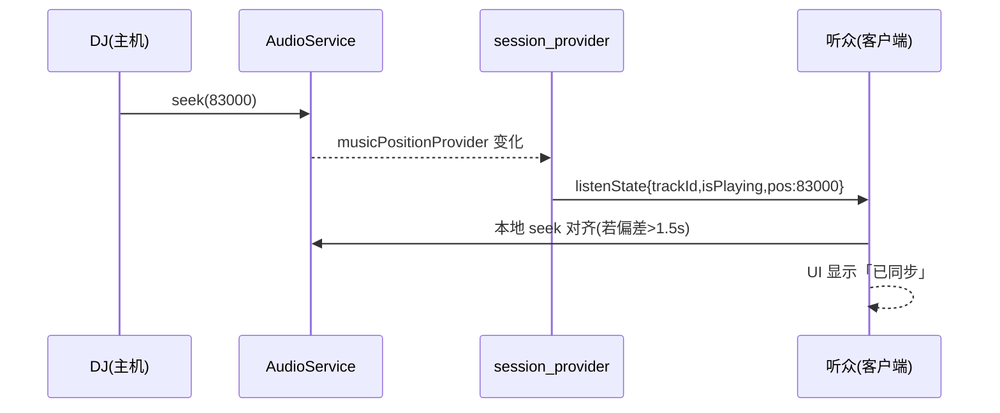
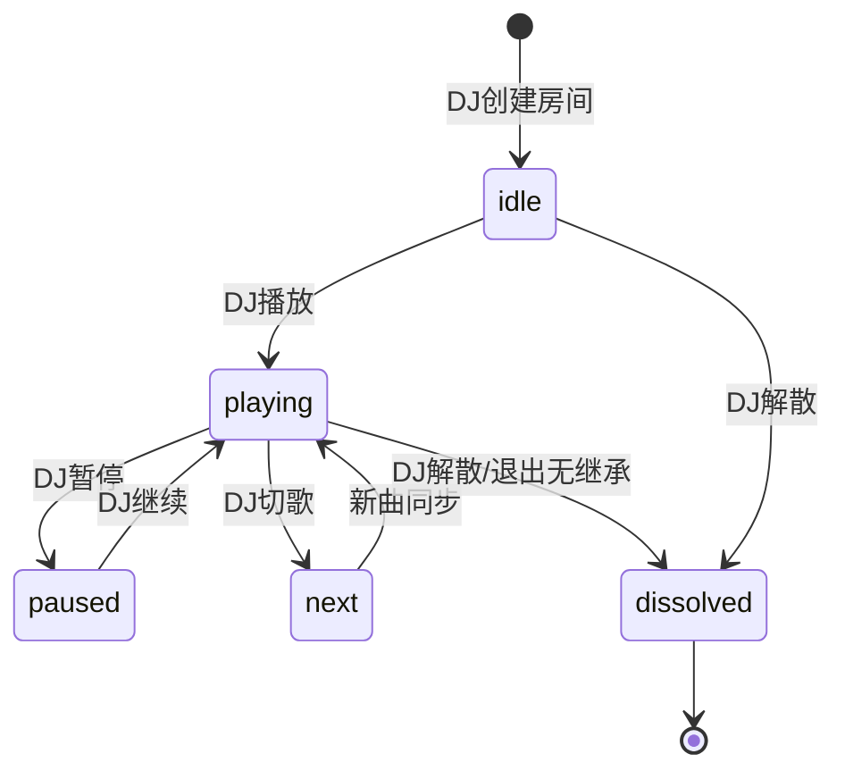

# 一起听（电台·同步收听子能力） · 产品需求文档（PRD）

> 模块定位：`xingli_music` 社交扩展 → **电台（Radio Station）** 的「同步收听」子能力
> 文档版本：`0.1.0_draft` · 详尽规格
> 关联文档：[校园点歌系统 PRD](./PRD_校园点歌系统.md) · [总览与原型导航](./README_社交模块.md)
>
> ⚠️ **战略定位**：本模块后续统一演进为「电台」功能。一起听**不是独立系统**，
> 而是电台的「同步收听」子能力（听众跟随电台 DJ 同步播放）。
> 电台核心抽象见 [README_社交模块.md](./README_社交模块.md) §1–§3。

---

## 1. 背景与目标

### 1.1 背景
异地恋、宿舍连麦、好友同步听歌是音乐 App 高频诉求。`xingli_music` 已有联机实时架构（`lib/providers/net/session_provider.dart`）与 `NetMsgType.listenState`（注释明确「一起听」语义）、`requestListen`、`chat` 等消息类型，且 `NetRole.host` + `dj` 字段天然对应「电台 DJ」，主机-客户端拓扑已就绪。**本 PRD 描述电台的「同步收听」子能力：将已有的联机骨架产品化为听众跟随 DJ 同步播放与互动的闭环**，而非从零新建。

### 1.2 目标
- **G1** 任一用户可创建电台成为 DJ（主机），好友加入后**同步播放同一首歌、同一进度**。
- **G2** DJ 切歌/暂停/拖进度，所有客户端在容差内跟随（≤1.5s 对齐）。
- **G3** 房间内实时聊天 + 同步歌词 + 表情互动。
- **G4** 复用现有 `AudioService` 与 `nowPlayingProvider`/`musicPositionProvider` 作为真值源，客户端只做「跟随渲染」。

### 1.3 非目标
- 不做多人同时改歌的「民主投票切歌」（v1 由 DJ 独占控制权，可选「听众点歌」走 §3.4，即电台点歌队列子能力）。
- 不做跨平台不同步源混听（同一电台所有人须能播同一 `Track`，否则降级提示）。
- 不替代校园点歌的广播台单向模型（见另一 PRD，二者房间分离）。

---

## 2. 用户角色

| 角色 | 网络角色 | 说明 |
|---|---|---|
| DJ / 房主 | `NetRole.host` | 控制播放，真值源；可转让、可踢人、可禁聊 |
| 听众 | `NetRole.client` | 跟随播放，可聊天/点赞/请求点歌 |
| 系统 | — | 状态广播、超时回收 |

> 直接复用 `session_provider.dart` 的 `NetRole` / `PeerInfo`，不新建角色枚举。

---

## 3. 功能清单

### 3.1 DJ（房主）
- **F-H1 创建房间**：命名 + 公开/私密（私密发邀请码）+ 是否允许听众点歌。
- **F-H2 播放控制**：play/pause/next/prev/seek 实时下发全房。
- **F-H3 歌单编排**：本地队列即房间歌单，听众可见。
- **F-H4 点歌审核**：开启后听众点歌进「待审」，DJ 通过则插播。
- **F-H5 房间管理**：转让房主、踢人、禁言、解散。

### 3.2 听众（Client）
- **F-C1 加入房间**：公开列表进入 / 邀请码加入。
- **F-C2 同步跟随**：自动跟随 DJ 播放状态与进度（无手动控制，或本地仅「暂离」）。
- **F-C3 实时聊天**：房间内聊天（复用 `chat` 消息）。
- **F-C4 互动**：点赞、表情飘屏、同步歌词高亮。
- **F-C5 请求点歌**：房主开启时，发起点歌（曲目走聚合搜索）进入 DJ 收件箱。

### 3.3 公共
- **F-P1 状态广播**：`listenState` 每 ~500ms 或事件触发下发 `{trackId, isPlaying, positionMs}`。
- **F-P2 断线重连**：客户端掉线重进房拉全量快照追平。
- **F-P3 离开**：听众退出释放席位；DJ 退出则房间移交或解散。

### 3.4 与校园点歌（点歌队列）的关系
- 二者同属一个**电台房**，通过能力开关 `RoomCaps { syncListen, acceptOrder }` 区分形态（见 [README_社交模块.md](./README_社交模块.md) §3）：
  - 校园广播台：开 `acceptOrder`（点歌队列）+ 开 `syncListen`（听众同步收听）。
  - 纯好友一起听：开 `syncListen`、关 `acceptOrder`。
- 听众点歌（§3.2 F-C5）即写入电台的「点歌队列」子能力，DJ 审核通过后插播，由本同步收听能力推送给全员。

---

## 4. 核心用例

### UC-1 创建并邀请
```
1. DJ 点「一起听」→ 创建房间（公开/私密）
2. App 生成房间 + 邀请码；公开房进「附近/好友」列表
3. 好友点加入 → 进房拉快照（当前曲+进度+歌单+聊天历史）
4. DJ 播放 → 全员同步
```

### UC-2 同步跟随（关键）
```
1. DJ 在本地 seek 到 1:23
2. AudioService 真值 → nowPlayingProvider/musicPositionProvider 变化
3. session_provider 侦听变化 → 发 listenState{trackId,pos=83000,isPlaying}
4. 客户端收到 → 比对本地：偏差>1.5s 则本地 seek 对齐；否则仅校正进度文本
5. 听众界面显示「与房主同步中」
```

### UC-3 听众点歌插播
```
1. 听众点「点歌」→ 选曲 → requestListen/orderSong
2. DJ 收件箱出现 → 通过 → 插入下一首
3. DJ 曲终自动接播 → 全员同步新曲
```

---

## 5. 同步协议（核心设计）

### 5.1 真值源与跟随模型
- **真值源**：DJ 端 `AudioService`（现有 `audioServiceProvider`）。
- **广播**：`session_provider` 订阅 `nowPlayingProvider` / `isPlayingProvider` / `musicPositionProvider`，变化即发 `listenState`。
- **客户端跟随**：收到 `listenState` 后：
  - 若 `trackId` 不同 → 本地 `audioService.playTrack(sameTrack)`（需客户端有该音源权限）。
  - 若 `isPlaying` 不同 → play/pause 对齐。
  - 若 `|positionMs - localPos| > 1500` → `seek` 对齐；否则仅更新进度显示，避免抖动。

### 5.2 时序图


### 5.3 消息类型（`net_message.dart` 已有/扩展）
```dart
// 已存在（复用）
listenState    // DJ→全员：播放状态同步
requestListen  // 申请加入一起听
chat           // 房间聊天
// 建议新增
listenInvite   // 房主邀请（含邀请码）
roomSnap       // 进房全量快照（track+pos+queue+chat）
kickPeer       // 踢人
transferHost   // 转让房主
```

---

## 6. 状态机



---

## 7. 数据模型

### 7.1 复用
- `PeerInfo`（`session_provider.dart`）：房间成员。
- `Track`（`lib/models/track.dart`）：歌单曲目。
- `NetRole`：host / client。

### 7.2 新增
```dart
class ListenRoom {
  final String roomId;
  final String name;
  final String hostPeerId;
  final bool isPrivate;
  final String? inviteCode;
  final bool allowAudienceOrder;
  final List<String> clientPeerIds;
  final RoomKind kind; // listen | campus
}

class RoomSnapshot {
  final Track? currentTrack;
  final bool isPlaying;
  final int positionMs;
  final List<Track> queue;
  final List<ChatMsg> recentChat;
}
```

---

## 8. 接口契约

### 8.1 状态同步（DJ→全员，复用 listenState）
```
NetMsg.listenState {
  type: "listenState",
  payload: { trackId: str, isPlaying: bool, positionMs: int }
}
```

### 8.2 进房快照（房主→新成员）
```
NetMsg.roomSnap {
  type: "roomSnap",
  payload: RoomSnapshot
}
```

### 8.3 加入请求（客户端→房主）
```
NetMsg.requestListen {
  type: "requestListen",
  payload: { inviteCode: str|null, peer: PeerInfo }
}
```

### 8.4 客户端跟随执行（本地）
```
// 伪代码
onListenState(msg):
  if msg.trackId != currentTrack.id: audio.playTrack(resolve(msg.trackId))
  if msg.isPlaying != isPlaying: msg.isPlaying ? audio.play() : audio.pause()
  if abs(msg.positionMs - audio.positionMs) > 1500: audio.seek(msg.positionMs)
```

---

## 9. 权限矩阵

| 动作 | DJ | 听众 | 系统 |
|---|---|---|---|
| 播放/暂停/切歌/seek | ✅ | ❌ | ❌ |
| 创建房间 | ✅ | ❌ | ❌ |
| 加入公开房 | ❌ | ✅ | — |
| 邀请码加入 | ❌ | ✅(持码) | — |
| 聊天 | ❌(除非加入) | ✅ | — |
| 点歌(开权限时) | 审批 | ✅发起 | — |
| 踢人/禁言/转让 | ✅ | ❌ | — |
| 解散 | ✅ | ❌ | 超时回收 |

---

## 10. 埋点

| 事件 | 字段 |
|---|---|
| listen_room_create | isPrivate, allowOrder |
| listen_room_join | via(invite/public) |
| listen_sync_drift | maxDriftMs（对齐时记录偏差） |
| listen_chat_send | len |
| listen_order_request | source |
| listen_host_transfer / kick | — |

---

## 11. 非功能需求

- **NF-1 同步精度**：客户端进度与 DJ 偏差稳态 < 1.5s；seek 后 2s 内对齐。
- **NF-2 带宽**：`listenState` 节流 ~500ms/次，空闲无流量；聊天与状态分离通道。
- **NF-3 容错**：客户端短暂断网（<30s）重连后拉快照追平；DJ 断网则房间冻结，超时 60s 解散或弹「转让」。
- **NF-4 一致源**：所有人须能解析同一 `Track`（同音源登录），否则客户端提示「无法同步该曲」并跳过。
- **NF-5 复用**：不新建播放引擎，全部走 `AudioService` + 现有 provider 订阅。

---

## 12. 原型线框

### 12.1 一起听入口（我的/好友页）
```
┌─────────────────────────────┐
│  一起听                     │
├─────────────────────────────┤
│  [ + 创建房间 ]             │
│  进行中的房间                │
│  ┌───────────────────────┐  │
│  │ 🎧 周末蹦迪房  DJ:阿星│  │
│  │   3人同步中 · 晴天     │  │
│  └───────────────────────┘  │
│  邀请我                     │
│  ┌───────────────────────┐  │
│  │ 小林 邀请你一起听      │  │
│  │ [接受] [忽略]          │  │
│  └───────────────────────┘  │
└─────────────────────────────┘
```

### 12.2 房间内（听众视角，跟随态）
```
┌─────────────────────────────┐
│ ← 周末蹦迪房   3人在线   ⋮   │
├─────────────────────────────┤
│   [ 大封面 ]                 │
│   晴天 - 周杰伦              │
│   ▶ 与房主同步中 · 01:23     │
│   ━━━━━●━━━━━━━━  03:29     │
│   (控制条禁用，仅显示同步)   │
├─────────────────────────────┤
│   💬 聊天                    │
│   阿星: 这首绝了！           │
│   你: 哈哈哈哈               │
│   [输入…]   [🎵点歌]         │
└─────────────────────────────┘
```

### 12.3 房间内（DJ 视角，控制态）
```
┌─────────────────────────────┐
│ ← 周末蹦迪房(我)  ⋮          │
├─────────────────────────────┤
│   [ 大封面 ]                 │
│   晴天 - 周杰伦  你正在播放  │
│   ▶ 00:01 ━━━●━━━━ 03:29     │
│   [⏮][⏯][⏭]  🔁 🔀        │
├─────────────────────────────┤
│  歌单(同步给全员)            │
│   1. 晴天 ▶                 │
│   2. 稻香                    │
│   3. 七里香(听众点歌待播)    │
│   [+加歌] [点歌箱 1]         │
└─────────────────────────────┘
```

---

## 13. 复用清单

| 能力 | 现有代码 | 用法 |
|---|---|---|
| 联机拓扑 | `session_provider.dart` (`NetRole`/`PeerInfo`) | 房间成员与角色 |
| 实时消息 | `net_message.dart` (`listenState`/`chat`/`requestListen`) | 同步与聊天通道 |
| WebSocket | `net_node.dart` | 房间长连 |
| 局域网发现 | `lan_discovery` (UDP 8767) | 发现附近房间 |
| 播放真值 | `audioServiceProvider` / `nowPlayingProvider` / `musicPositionProvider` | DJ 状态源 |
| 播放控制 | `playback_notifier` | DJ 切歌/seek |
| 曲目模型 | `Track` | 歌单/点歌 |
| 选曲 | `aggregate_search_*` | 听众/DJ 加歌 |
| 通知 | `notification_center` | 邀请/点歌提醒 |

---

## 14. 风险与待决
- **OQ-1** 跨音源不同步：听众无该曲音源权限时如何处理？建议「跳过+提示」。
- **OQ-2** 公网延迟下 1.5s 对齐是否够？弱网可放宽至 3s 并显式「追补中」。
- **OQ-3（已决·战略）** 与点歌系统（点歌队列）合并为单一**电台房**，通过 `RoomCaps { syncListen, acceptOrder }` 区分形态，不再保留两套独立房间类型（原 `RoomKind` 设计废弃）。详见 [README_社交模块.md](./README_社交模块.md) §3。
- **OQ-4（已决）** `listenState` 实际下发点已核对：`session_provider.dart` 的 `_startDj()` 订阅 `nowPlayingProvider`+`isPlayingProvider`，切歌/播放态变化即广播；`Timer.periodic(2s)` 周期广播进度；`_applyRemoteListen()` 客户端接收后跟随（曲不同则 `playMusic`，否则 `seek`+`resume/pauseOnly`）。同步链路已完整实现，文档规格与现有代码一致。
- **传输通道（已决）** 跨公网与点歌系统一致，采用 **relay-server 中转**（NAT 打洞失败回退）。所有 `listenState`/`chat`/`roomSnap` 经 relay 路由，relay 不存储播放内容。弱网时 `NF-1` 对齐窗口放宽到 3s。
