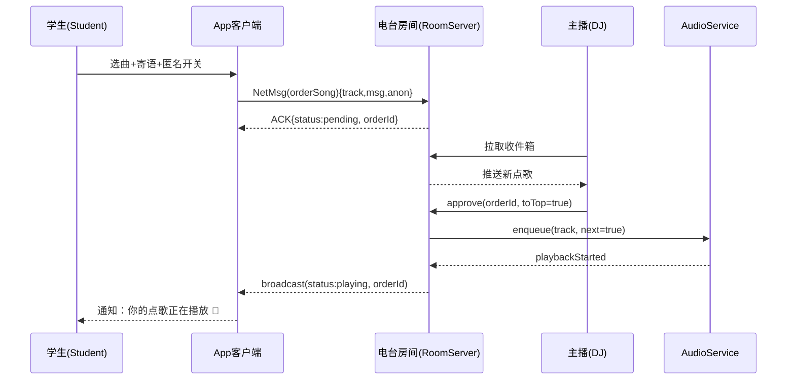
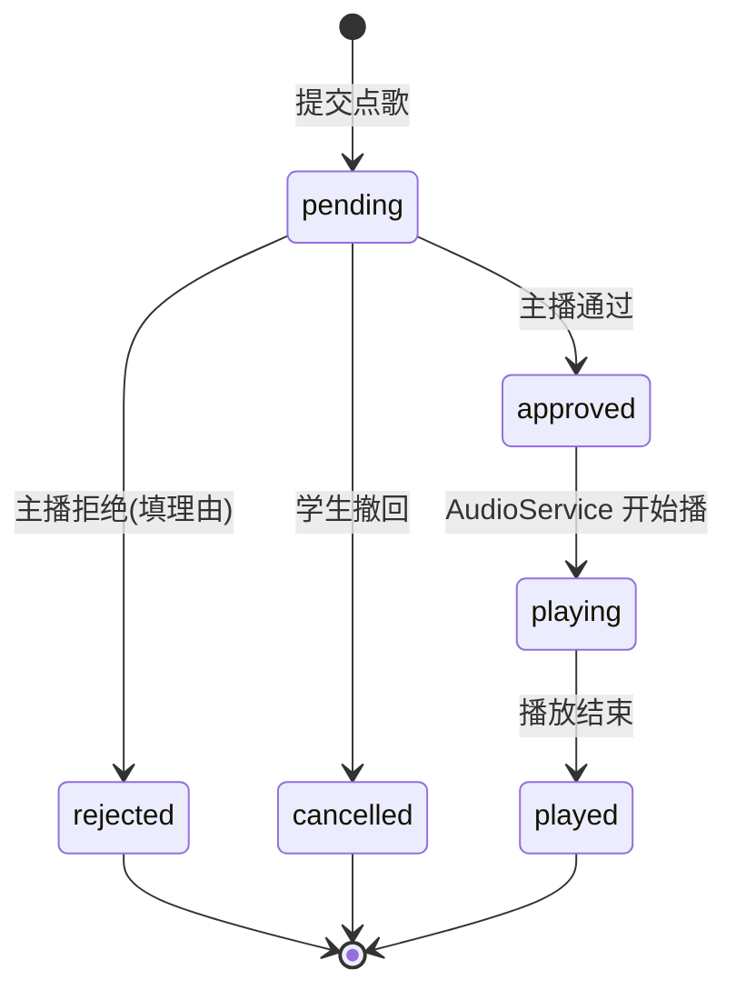

# 校园点歌（电台·点歌队列子能力） · 产品需求文档（PRD）

> 模块定位：`xingli_music` 社交扩展 → **电台（Radio Station）** 的「点歌队列」子能力
> 文档版本：`0.1.0_draft` · 拟定时长：详尽规格
> 关联文档：[一起听系统 PRD](./PRD_一起听系统.md) · [总览与原型导航](./README_社交模块.md)
>
> ⚠️ **战略定位**：本模块后续统一演进为「电台」功能。校园点歌**不是独立系统**，
> 而是电台在「校园广播台」场景下的默认开场形态（实名/班级/匿名表白）。
> 电台核心抽象见 [README_社交模块.md](./README_社交模块.md) §1–§3。

---

## 1. 背景与目标

### 1.1 背景
校园广播站、迎新晚会、食堂大屏、班级活动长期依赖「纸条点歌 / 公众号留言 / 现场喊话」等低效方式。
`xingli_music` 已具备完整的本地+多音源（B站/网易云/本地/电台）播放能力与联机实时架构（见 `lib/providers/net/session_provider.dart`、`lib/services/net/net_message.dart`），
其 `NetRole.host` + `dj` 字段天然对应「电台 DJ」。本 PRD 描述电台的**点歌队列**子能力：听众向电台提交点歌，DJ 审核后插播。
复用现有 `Track` 模型、聚合搜索（`aggregate_search_*`）与 WebSocket 联机层，低成本补上「校园场景点歌」闭环。

### 1.2 目标
- **G1** 听众可在 App 内向电台（校园广播台/班级歌单）发起点歌，附寄语与匿名选项。
- **G2** 电台 DJ 收到点歌单，审批后一键推入播放队列，自动走现有 `AudioService` 播放。
- **G3** 点歌状态对听众可见（已收到 / 已通过 / 已播放 / 被拒），形成正向反馈。
- **G4** 复用现有联机协议，校园内可走局域网（LAN discovery 8767）+ relay-server，不依赖自建重型后端。

### 1.3 非目标（Out of Scope）
- 不建设独立账号中心（复用各音源登录态 + 新增轻量「校园身份」：学号/昵称/班级，仅本地+房间内广播）。
- 不做跨校联邦、不做付费打赏抽成（v1）。
- 不替代广播台现有硬件采播链路，仅提供「歌单来源」与「点歌入口」。
- **本 PRD 只覆盖点歌队列**；同步收听（听众跟随 DJ 播放）由 [一起听系统 PRD](./PRD_一起听系统.md) 覆盖，二者同属一个电台房。

---

## 2. 用户角色（Persona）

| 角色 | 标识 | 核心诉求 | 权限 |
|---|---|---|---|
| 点歌学生 | `Student` | 快速点歌、看状态、匿名表白 | 发起点歌、查看自己点歌状态、取消待审点歌 |
| 广播台主播 | `DJ` / `Host` | 收单、审核、插播 | 创建电台房间、审批/拒绝、置顶、推歌入队、禁言某学生 |
| 班级管理员 | `ClassAdmin` | 班级歌单自治 | 创建班级房间、管理班级成员、审核 |
| 系统/广播 | `System` | 公告、整点报时 | 仅发送系统通知事件 |

> 校园身份不强制实名：学生首次进入房间填「昵称 + （可选）班级」，生成房间内 `PeerId`，复用 `lib/providers/net/session_provider.dart` 的 `PeerInfo` 模型扩展 `classroom` 字段。

---

## 3. 功能清单（Function List）

### 3.1 学生端
- **F-S1 发现电台**：首页「校园」Tab → 电台列表（局域网发现的广播台 + 我加入的班级房间）。
- **F-S2 进入房间**：显示房间名/主播在线状态/当前播放/点歌队列长度。
- **F-S3 发起点歌**：选曲（复用聚合搜索）→ 填寄语（≤50字）→ 选匿名/实名 → 提交。
- **F-S4 我的点歌**：追踪每首点歌状态机（见 §6）。
- **F-S5 取消点歌**：仅「待审」状态可取消。
- **F-S6 点赞/应援**：对队列中点歌条目点赞（轻互动，可选）。

### 3.2 主播端（DJ）
- **F-D1 创建电台房间**：命名 + 选择「广播台/班级」类型 + 设置是否需审核、是否允许匿名。
- **F-D2 点歌收件箱**：实时流入点歌请求，支持按「待审/已通过/已播/已拒」分栏。
- **F-D3 审批动作**：通过（进队列）/ 拒绝（填理由）/ 置顶（插队到下一首）。
- **F-D4 一键推播**：通过的点歌自动或手动推入 `AudioService` 播放队列（复用 `playback_notifier`）。
- **F-D5 房间公告**：发送系统通知（复用 `notification_center`）。
- **F-D6 成员管理**：查看在线学生、禁言、移出。

### 3.3 公共
- **F-C1 实时同步**：房间内当前播放、队列、点歌状态通过 WebSocket 广播（复用 `net_message` 协议扩展 `orderSong` 类型）。
- **F-C2 离线留言**：主播离线时点歌进入「待主播上线」队列，上线后推送。
- **F-C3 应用内通知**：点歌状态变更触发 `NotificationEvent`（复用 `lib/models/notification_event.dart`）。

---

## 4. 核心用例（Core Use Cases）

### UC-1 学生点歌（主流程）
```
参与者：Student, App, RoomServer(广播台), AudioService
1. Student 打开「校园」Tab，点击在线电台
2. App 展示房间详情（当前播放/队列）
3. Student 点「点歌」→ 聚合搜索选曲 → 填寄语 → 提交
4. App 发送 NetMsg(orderSong) 到房间
5. RoomServer 入「待审」队列，回 ACK（状态=待审）
6. Student 在「我的点歌」看到状态=待审
7. DJ 通过 → 推入 AudioService 队列 → 广播状态=已通过
8. 播放到该曲 → 广播状态=已播放
```

### UC-2 主播审核并插播
```
参与者：DJ, RoomServer, AudioService
1. DJ 收件箱出现新点歌（实时）
2. DJ 点「置顶」→ 该曲插入播放队列下一首
3. AudioService 播完当前曲自动接播 → 广播状态=已播放
4. 被拒点歌填理由回学生
```

### UC-3 匿名表白点歌
```
1. Student 勾选「匿名」提交
2. RoomServer 存储时剥离昵称，展示为「匿名同学」
3. 主播端仅见寄语与曲目
```

---

## 5. 关键流程（Mermaid 时序图）



---

## 6. 数据模型（概要）

### 6.1 复用现有
- `Track`（`lib/models/track.dart`）：点歌曲目直接复用，无需新建。
- `PeerInfo`（`session_provider.dart`）：扩展字段 `classroom`、`role`。
- `NotificationEvent`（`lib/models/notification_event.dart`）：复用事件通道。

### 6.2 新增实体
```dart
// 点歌请求
class OrderSong {
  final String orderId;
  final String roomId;
  final String fromPeerId;
  final String? fromName;     // 匿名时为 null
  final bool anonymous;
  final Track track;          // 复用现有模型
  final String? message;      // 寄语 ≤50字
  final OrderStatus status;   // 见状态机 §7
  final DateTime createdAt;
  final int likes;
}

// 电台房间
class CampusRoom {
  final String roomId;
  final String name;
  final RoomType type;        // broadcast | classroom
  final String hostPeerId;
  final bool requireApprove;
  final bool allowAnonymous;
  final List<String> memberPeerIds;
}

enum OrderStatus { pending, approved, playing, played, rejected, cancelled }
enum RoomType { broadcast, classroom }
```

### 6.4 网络拓扑与中继（OQ-2 已决）
跨公网采用 **relay-server 中转**，链路选择策略：

```
客户端 ──┬─(同局域网)──> 广播台/房间主机      [直连, 最低延迟]
         ├─(NAT 打洞成功)─> P2P               [直连]
         └─(打洞失败/跨公网)─> relay-server ─> 主机/全员  [中转, 默认公网路径]
```

- **relay-server** 仅做 `NetMsg` 的路由与房间会话保持，**不解析、不存储点歌内容**（隐私最小化）。
- 客户端优先 LAN discovery（UDP 8767）与 UDP 打洞；超时（~2s）未建立直连即回退 relay。
- 房间状态以「主机/DJ 为权威」，relay 仅转发，避免产生多副本真值。
- 离线留言（F-C2）由 relay 暂存待上线推送；relay 重启后内存态丢失的待播点歌以主机本地队列为准。
- 对应延迟预算见 `NF-1`（局域网 <1s / relay <3s）。

### 6.3 网络消息扩展（`net_message.dart`）
在 `NetMsgType` 新增：
```dart
orderSong,      // 学生→房间：发起点歌
orderAck,       // 房间→学生：回执+状态
orderUpdate,    // 房间→全员：状态变更广播
roomCreate, roomList, roomJoin, roomAnnounce
```

---

## 7. 状态机（点歌生命周期）



---

## 8. 接口契约（伪代码 / 协议）

### 8.1 发起点歌（客户端→房间）
```
NetMsg.orderSong {
  type: "orderSong",
  roomId: str,
  payload: {
    track: Track,            // 序列化现有模型
    message: str|null,
    anonymous: bool
  }
}
```

### 8.2 状态回执（房间→学生）
```
NetMsg.orderAck {
  type: "orderAck",
  payload: { orderId: str, status: "pending" }
}
```

### 8.3 状态广播（房间→全员）
```
NetMsg.orderUpdate {
  type: "orderUpdate",
  payload: { orderId: str, status: OrderStatus, at: int }
}
```

### 8.4 主播推歌（房间→AudioService 编排）
```
// 复用 playback_notifier 的 enqueue
audioEnqueue(track, { next: bool, fromOrderId: str })
```

---

## 9. 权限矩阵

| 动作 | Student | DJ/Host | ClassAdmin | System |
|---|---|---|---|---|
| 发起点歌 | ✅ | ✅ | ✅ | ❌ |
| 匿名点歌 | 房间允许时 | — | 房间允许时 | — |
| 取消待审点歌 | 自己的 | ❌ | ❌ | ❌ |
| 审批/拒绝 | ❌ | ✅ | ✅(班级) | ❌ |
| 置顶插播 | ❌ | ✅ | ✅(班级) | ❌ |
| 创建房间 | ❌ | ✅ | ✅ | ❌ |
| 禁言成员 | ❌ | ✅ | ✅(班级) | ❌ |
| 发公告 | ❌ | ✅ | ✅ | ✅ |

---

## 10. 埋点（Analytics）

| 事件 | 触发点 | 字段 |
|---|---|---|
| order_song_submit | 提交点歌 | roomId, source, anon, len(msg) |
| order_song_approve | 主播通过 | roomId, toTop |
| order_song_reject | 主播拒绝 | roomId, reasonCode |
| order_play_start | 开始播该点歌 | orderId, waitSec |
| room_create / room_join | 房间生命周期 | type |

---

## 11. 非功能需求（NFR）

- **NF-1 实时性**：点歌→主播收件箱延迟 < 1s（局域网）/ < 3s（relay）。
- **NF-2 一致性**：房间内所有成员队列/状态最终一致（WebSocket 广播 + 进房全量快照）。
- **NF-3 可用性**：主播离线时点歌不丢，上线后推送（F-C2）。
- **NF-4 性能**：单房间点歌队列上限 200 条，超出拒绝并提示。
- **NF-5 隐私**：匿名点歌不落昵称，主播端无法反查。
- **NF-6 兼容**：复用现有 `net_node` WebSocket 与 `lan_discovery`，不引入新长连服务。

---

## 12. 原型线框（ASCII Wireframe）

### 12.1 校园 Tab（发现电台）
```
┌─────────────────────────────┐
│  校园  🔍                   │
├─────────────────────────────┤
│ 我的班级                     │
│  ┌───────────────────────┐  │
│  │ 高三(7)班歌单   3人在线│  │
│  └───────────────────────┘  │
│ 附近广播台（局域网）         │
│  ┌───────────────────────┐  │
│  │ 📻 晨光广播台   ●LIVE  │  │
│  │   正在播：晴天-周杰伦  │  │
│  └───────────────────────┘  │
│  ┌───────────────────────┐  │
│  │ 📻 食堂BGM台   在线    │  │
│  └───────────────────────┘  │
└─────────────────────────────┘
```

### 12.2 房间内（学生视角）
```
┌─────────────────────────────┐
│ ← 晨光广播台        ● LIVE   │
├─────────────────────────────┤
│  [封面] 晴天 - 周杰伦        │
│  ▶ 播放中 · 队列 12 首       │
├─────────────────────────────┤
│  📜 点歌队列                 │
│   1. 稻香(匿名) 已通过       │
│   2. 七里香 待审             │
│   3. 后来(表白) 已播放 ✅    │
├─────────────────────────────┤
│  [+ 点歌]  [我的点歌]        │
└─────────────────────────────┘
```

### 12.3 发起点歌 Sheet
```
┌─────────────────────────────┐
│  点歌 → 晨光广播台       ✕   │
├─────────────────────────────┤
│  搜索歌曲…                   │
│  [ 晴天 - 周杰伦      ✓ ]    │
├─────────────────────────────┤
│  寄语（给主播/TA）           │
│  ┌───────────────────────┐  │
│  │ 这首送给三班的你 🌟      │  │
│  └───────────────────────┘  │
│  ☑ 匿名点歌                  │
├─────────────────────────────┤
│        [  提 交 点 歌  ]      │
└─────────────────────────────┘
```

### 12.4 主播收件箱（DJ 视角）
```
┌─────────────────────────────┐
│  收件箱  待审 3 / 已通过 5    │
├─────────────────────────────┤
│ ┌─────────────────────────┐ │
│ │ 七里香 - 周杰伦          │ │
│ │ "考研加油！" 实名:小林   │ │
│ │ [通过] [置顶] [拒绝]     │ │
│ └─────────────────────────┘ │
│ ┌─────────────────────────┐ │
│ │ 匿名同学                 │ │
│ │ "喜欢你很久了"           │ │
│ │ [通过] [置顶] [拒绝]     │ │
│ └─────────────────────────┘ │
└─────────────────────────────┘
```

---

## 13. 复用清单（Reuse Map）

| 能力 | 现有代码 | 本系统用法 |
|---|---|---|
| 曲目模型 | `lib/models/track.dart` | 点歌曲目直接复用 |
| 选曲搜索 | `aggregate_search_*` | 发起点歌的选曲入口 |
| 播放引擎 | `audioServiceProvider` / `playback_notifier` | 主播推歌入队 |
| 实时通道 | `net_node` / `net_message` | 新增 `orderSong` 系列消息 |
| 局域网发现 | `lan_discovery` (UDP 8767) | 发现附近广播台 |
| 通知 | `notification_center` / `NotificationEvent` | 点歌状态变更提醒 |
| 成员模型 | `PeerInfo` | 扩展 `classroom`/`role` |
| 路由 | `Navigator.push` | 校园 Tab / 房间页挂接 |

---

## 14. 风险与待决（Open Questions）
- **OQ-1** 主播端身份如何认定？v1 以「创建房间者即 DJ」为准，不做后台审核。
- **OQ-2（已决）** 跨公网通道：采用 **relay-server 中转（NAT 穿透失败回退中继）** 方案。
  即客户端优先尝试 P2P（局域网发现 / UDP 打洞），失败则统一经 relay-server 中转所有 `NetMsg`。
  公网直连不在范围，relay 为默认公网路径。对应 `NF-1` 的 relay 延迟预算 < 3s。
- **OQ-3（已决·战略）** 点歌与「一起听」合并为单一**电台房**，通过能力开关 `RoomCaps { syncListen, acceptOrder }` 区分形态：
  - 校园广播台：开 `acceptOrder`（点歌队列）+ 开 `syncListen`（听众可同步收听）。
  - 纯好友一起听：开 `syncListen`、关 `acceptOrder`。
  - 纯点歌台：开 `acceptOrder`、关 `syncListen`。
  二者不再是两个独立系统，均为电台子能力（见 [README_社交模块.md](./README_社交模块.md) §3）。
