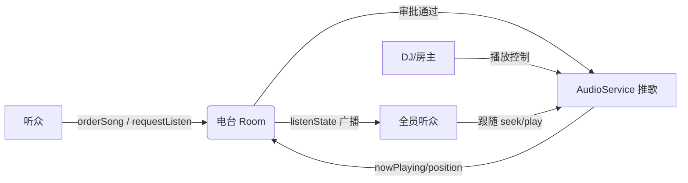

# 电台模块 · 总览与原型导航

> `xingli_music` 社交扩展（演进目标：**电台 Radio Station**）
> 文档集：`docs/social/`
> 拟定日期：2026-08-22 · 状态：详尽规格草案（待评审）

---

## 1. 战略定位（重要）

本模块后续将统一演进为 **「电台（Radio Station）」** 功能。
`校园点歌` 与 `一起听` **不是两个并列产品**，而是电台的**两个子能力**：

```
电台 Radio Station（核心抽象，对应代码 NetRole.host / dj）
├── 同步收听（原「一起听」）  —— 听众跟随电台 DJ 同步播放
└── 点歌队列（原「校园点歌」）—— 听众向电台提交点歌，DJ 审核后插播
```

- **电台 = 主机（DJ）+ 听众** 的实时房间，与现有 `session_provider` 的 `NetRole.host`/`client`、`dj` 字段、`listenState` 协议天然对齐。
- 校园点歌只是电台在「校园广播台」场景下的**默认开场形态**（实名/班级/匿名表白），不是独立系统。
- 文档当前仍保留两份 PRD 以便细化，但统一以电台为核心术语，避免后续返工。

---

## 2. 模块地图

```
xingli_music 社交扩展（电台演进）
├── PRD_电台核心.md          （电台房间/成员/DJ/同步底座，统管两子能力）★ 新核心
├── PRD_校园点歌系统.md      （电台的「点歌队列」子能力，校园场景细化）
└── PRD_一起听系统.md        （电台的「同步收听」子能力，细化）
```

> 电台核心已落地为独立 PRD（[PRD_电台核心.md](./PRD_电台核心.md)）。点歌与一起听作为挂在核心上的子能力，通过 `RoomCaps { syncListen, acceptOrder }` 区分形态。

---

## 3. 电台核心抽象（一处定义，两子能力复用）

| 概念 | 代码对应 | 说明 |
|---|---|---|
| 电台房 | `RoomState`（`hostSeed`/`hostOptions`/`dj`） | 一个 DJ + N 听众的实时房间 |
| 电台 DJ | `NetRole.host` + `dj=true` | 播放真值源，控制切歌/进度 |
| 听众 | `NetRole.client` | 跟随播放、可聊天、可点歌 |
| 同步收听 | `listenState` 广播 | DJ 播放态→全员跟随（见一起听 PRD） |
| 点歌队列 | `orderSong` 系列消息 | 听众点歌→DJ 审核→插播（见点歌 PRD） |
| 能力开关 | `RoomCaps { syncListen, acceptOrder }` | 电台可只听不点、或只点不听、或全开 |

---

## 4. 复用底座（关键，避免重复造轮子）

| 现有能力 | 代码位置 | 电台用法 |
|---|---|---|
| 联机拓扑 | `lib/providers/net/session_provider.dart` | 电台成员、`NetRole`、`PeerInfo`、`dj` 字段 |
| 实时消息协议 | `lib/services/net/net_message.dart` | `listenState`/`chat`/`requestListen`/`orderSong` |
| WebSocket 节点 | `lib/services/net/net_node.dart` | 电台长连 |
| 局域网发现 | `lib/services/net/lan_discovery.dart` (UDP 8767) | 发现附近电台 |
| 播放引擎 | `lib/providers/audio/audio_providers.dart` | `AudioService` 作 DJ 真值源 |
| 播放状态 | `nowPlayingProvider` / `isPlayingProvider` / `musicPositionProvider` | 同步收听跟随、点歌推播 |
| 曲目模型 | `lib/models/track.dart` | 点歌/歌单 |
| 选曲搜索 | `aggregate_search_*` | 发起点歌/加歌 |
| 通知中心 | `lib/widgets/notification/` + `NotificationEvent` | 状态变更/邀请提醒 |
| 页面路由 | `Navigator.push` | 校园 Tab / 电台页挂载 |

**传输通道（已决）**：跨公网采用 **relay-server 中转**（NAT 打洞失败回退），relay 仅路由不存内容。

---

## 5. 角色对照

| 角色 | 电台 | 模型 |
|---|---|---|
| 发起方/听众 | 听众 `Client` | `PeerInfo`+扩展（班级/昵称） |
| 控制方 | 电台 DJ `Host` | `NetRole.host` + `dj` |
| 系统 | 公告/超时回收 | 事件/定时器 |

---

## 6. 原型导航（页面对照）

### 电台核心
- 电台 Tab（发现附近/好友电台） → 一起听 PRD §12.1 改造为「电台列表」
- 电台内·听众（跟随态） → 一起听 PRD §12.2
- 电台内·DJ（控制态） → 一起听 PRD §12.3

### 点歌队列（电台子能力，校园场景）
- 发起点歌 Sheet → 点歌 PRD §12.3
- 主播收件箱（DJ 视角） → 点歌 PRD §12.4
- 房间内点歌队列（听众视角） → 点歌 PRD §12.2

---

## 7. 关键流程串联图



---

## 8. 版本与待评审清单

- [x] 电台核心抽象已单列 `PRD_电台核心.md`（已建）
- [ ] 主播/电台主身份认定方案（OQ-1）
- [x] 跨公网通道（OQ-2）— **已决：relay-server 中转**
- [ ] 跨音源不同步降级策略（OQ-1 听）
- [x] 确认 `listenState` 实际下发触发点（OQ-4 **已决**：`_startDj()` 订阅 provider + 2s 周期广播 + `_applyRemoteListen` 客户端跟随，同步链路已完整实现）
- [ ] 点歌与同步收听合并为单一电台房的 `RoomCaps` 开关设计

---

## 9. 文档索引

| 文档 | 内容 |
|---|---|
| [PRD_电台核心.md](./PRD_电台核心.md) | ★ 战略核心：电台房/成员/DJ/同步底座 + RoomCaps 形态矩阵 |
| [PRD_校园点歌系统.md](./PRD_校园点歌系统.md) | 电台「点歌队列」子能力（校园场景细化） |
| [PRD_一起听系统.md](./PRD_一起听系统.md) | 电台「同步收听」子能力 |
| README_社交模块.md（本文件） | 总览、电台核心抽象、导航 |

---

## 10. 后续动作建议
1. 评审本战略定位（电台为核心）。
2. 电台核心已建（[PRD_电台核心.md](./PRD_电台核心.md)），统管房间/成员/同步底座，点歌与一起听作为子能力挂在 `RoomCaps` 下。
3. 技术侧优先核对 `session_provider` 中 `listenState` 是否已真正订阅 `musicPositionProvider` 下发（决定同步收听工作量）。
4. 校园点歌以「局域网电台 MVP」先行，验证 `orderSong` 协议。
5. 原型确认后，将 ASCII 线框升级为高保真（可在 Ardot 设计文件实现）。
